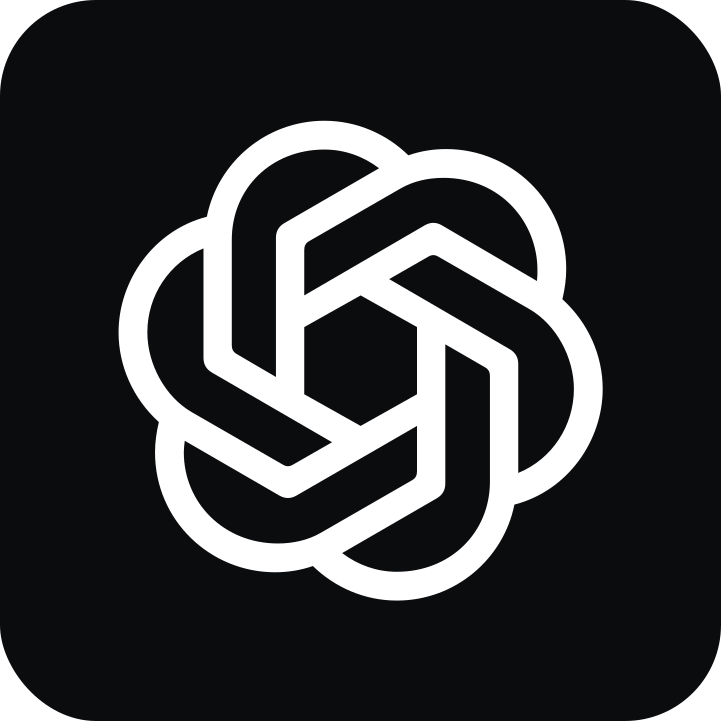

# Mindscape AI Local Core

> **Open-source, local-first cognitive engine for human-governable AI workflows.**

[English](README.md) | [中文](README.zh.md)

`mindscape-ai-local-core` is the open-source core of **Mindscape AI** — a **local-first**, **human-governable** cognitive engine for agentic workflows.

It turns your long-term goals, projects, and creative themes into a **governable, navigable mindscape** for AI that can **think and act with you across time** — with full traceability, rollback, and human oversight.

You can use it in two ways:

- as a **cognitive engine** inside your existing agent stack
- as an **end-to-end local workspace** with optional `Project / Flow / Playbook / Sandbox` actuation

It is also natively compatible with **Agent Skills (`SKILL.md`)** and **MCP**, so it can plug into existing agent workflows without requiring the local actuation layer.

### 🎯 Two Core Principles

| Principle | What it means |
|-----------|---------------|
| **Local-first** | Your data stays on your machine. Works offline. You own everything. |
| **Human-governable** | Every AI output is traceable, versionable, and rollback-able. You stay in control. |

> Most AI tools focus on "getting things done". Mindscape AI focuses on **governing how things get done** — so you can trace, compare, and roll back any AI-generated content at the segment level.

### 🎨 Mind-Lens: A Palette for Rendering

> **Mind-Lens is a Palette for rendering** — a user-authored control surface that *projects* values, aesthetics, and working style into AI execution, helping you **direct outputs consistently** across workflows.

Mind-Lens works as a **three-layer palette**:

1. **Global Preset** — your baseline palette (how you/your brand generally behaves)
2. **Workspace Override** — project-specific tuning (same person, different context)
3. **Session Override** — temporary knobs for this task (resets after the conversation)

Both the **Mindscape Graph** (author mode) and **Workspace execution** (runtime mode) operate on the same Lens contract — they just edit different scopes of the same palette.

---

## 🧠 Mindscape Engine

Mindscape AI is a local-first engine that compiles governance context, runs live deliberation, preserves long-term continuity, and optionally routes work into local or external execution layers.

> **Governance Context → Meeting Runtime ↔ Governed Memory Fabric → Optional Actuation / External Runtimes → Artifacts, Decisions, and Writeback**

The core pieces are:

- **Governance Context** — `Intent`, `Mind-Lens`, and `Policy` define why work matters, how trade-offs are made, and what boundaries cannot be crossed.
- **Meeting Runtime** — Mindscape Meeting handles live deliberation, clarification, convergence, dispatch, and loop closure.
- **Governed Memory Fabric** — evidence, episodic compression, durable memory, invalidation, and serving preserve continuity across runs.
- **Optional Actuation** — `Project / Flow / Playbook / Tools / Sandbox` or external runtimes turn cognition into execution when needed.
- **Reviewable Outputs** — execution traces, artifacts, decisions, and writebacks keep the system inspectable and correctable over time.

`Mind-Model VC` remains part of the system, but as a versioning dimension inside governance context rather than the primary name for the engine.

This repo packages these pieces into a local engine that can either plug into your existing agent stack or power an end-to-end local workspace.

---

## Plug Into Your Existing Agent Stack

> **Keep your workflow framework. Add Mindscape for deliberation and governed long-term continuity.**

Mindscape can sit beside your existing agentic workflow stack and provide the part most frameworks only sketch:

- **Before the run** — compile governance context and the right memory packet
- **During the run** — escalate ambiguity, conflict, or high-stakes reasoning into Mindscape Meeting
- **After the run** — consolidate evidence, promote durable memory, invalidate stale conclusions, and write continuity back for the next run

<table>
  <tr>
    <td align="center">
      <a href="https://openai.github.io/openai-agents-python/">
        
      </a>
      <br>
      <sub>OpenAI Agents SDK</sub>
    </td>
    <td align="center">
      <a href="https://docs.langchain.com/oss/javascript/langgraph/persistence">
        
      </a>
      <br>
      <sub>LangGraph</sub>
    </td>
    <td align="center">
      <a href="https://docs.crewai.com/en/concepts/flows">
        
      </a>
      <br>
      <sub>CrewAI</sub>
    </td>
  </tr>
  <tr>
    <td align="center">
      <a href="https://mastra.ai/workflows">
        
      </a>
      <br>
      <sub>Mastra</sub>
    </td>
    <td align="center">
      <a href="https://ai.pydantic.dev/">
        
      </a>
      <br>
      <sub>PydanticAI</sub>
    </td>
    <td align="center">
      <a href="https://docs.openclaw.ai/">
        
      </a>
      <br>
      <sub>OpenClaw</sub>
    </td>
  </tr>
</table>

Works with custom **MCP** and **A2A** agents too.

| Integration surface | What Mindscape provides |
|---------------------|-------------------------|
| **Tool / MCP layer** | Deliberation tools, memory packet preparation, reflection entry points |
| **Workflow hooks** | Pre-run context compilation and post-run consolidation / writeback |
| **Runtime adapter** | Workspace-bound execution context, governance constraints, trace-ready handoff |
| **Cross-agent continuity** | Episodic / core / procedural memory that survives sessions and frameworks |

**Important**: `Project / Flow / Playbooks / Sandbox` are **optional actuation modules** that you can attach when you want end-to-end local execution.

Framework logos are the property of their respective projects and are used here for integration identification.

---

## Scenario Families

Mindscape is best understood through the kinds of continuity it governs.

| Scenario family | What Mindscape governs | Example execution surfaces |
|-----------------|------------------------|----------------------------|
| **Brand and Content Governance** | Brand voice, storyline continuity, cross-channel consistency, rollback-able content decisions | websites, social media, newsletters, customer support |
| **Narrative Direction and Role Evolution** | Character arcs, performer cues, persona targets, storyline-to-execution continuity | film previs, creator workflows, community-facing digital personas |
| **Research and Knowledge Continuity** | Intent-aware research tracking, evidence packs, disagreement briefs, long-form synthesis | research assistants, writing systems, book workflows |
| **Practice and Coaching Loops** | Session memory, progress baselines, feedback safety, retention loops | coaching apps, guided practice systems, domain companions |
| **Agentic Workflow Sidecar** | Deliberation, reflection, memory packet routing, governed writeback across runs | OpenAI Agents SDK, LangGraph, CrewAI, custom MCP/A2A stacks |

These are **scenario families**.
Public documentation stays at the level of governance, deliberation, memory, continuity, and generic integration boundaries.

---

## Optional Local Actuation Layer

If you want end-to-end local execution, this repo also includes a **project / playbook** actuation stack:

```text
Project  →  Intents  →  Playbooks  →  AI Team Execution  →  Artifacts & Decisions
```

* **Project** – a long-lived lane such as "Launch my 2026 product", "Write a book every year", or "Run my content studio".
* **Intents** – concrete goals inside that project: "Define outline", "Research competitors", "Draft fundraising page".
* **Playbooks** – reusable workflows that tell your AI team *how* to help (steps, roles, tools).
* **AI Team Execution** – multiple AI roles (planner, writer, analyst…) collaborate, call tools, and produce drafts / plans / checklists.
* **Artifacts & Decisions** – the results are saved back into the workspace and can be exported, synced, or reused.

Examples of built-in system playbooks:

* `daily_planning` – Daily planning & prioritization
* `content_drafting` – Content / copy drafting

You can add your own playbooks to encode your personal workflows, client SOPs, or agency services.

### 🧱 Shareable expert viewpoints and working methods

If you use the optional local actuation layer, Mindscape can package a domain expert's **way of seeing, working, and setting execution boundaries** into reusable modules.

In practice, that module is built from a governed combination of:

- **Viewpoint layer**: `Mind-Lens` presets and overrides shape how problems are interpreted, how trade-offs are made, and what kind of output should be rendered.
- **Role layer**: AI role configs persist role identity, associated playbooks, allowed tools, and role-specific `mindscape_profile_override` adjustments.
- **Workflow layer**: playbooks carry `owner_type`, `visibility`, and `shared_with_workspaces`; the execution pipeline records the `effective_playbooks` that are actually in scope for the current workspace.
- **Portability layer**: portable export (including AI roles and playbooks) plus lens preset package / install let these configurations move across profiles, workspaces, or local instances.

This lets Mindscape package an expert's **distinctive viewpoint and working method** as a reusable module.

Product and application examples include:

- **Brand lead viewpoint**: reusable judgment for tone, review standards, content trade-offs, and cross-channel consistency.
- **Research editor viewpoint**: reusable discipline for evidence quality, disagreement handling, long-form structure, and citation standards.
- **Coach / companion viewpoint**: reusable cadence for feedback, progress checks, reflection loops, and safety boundaries.
- **Narrative direction viewpoint**: reusable continuity for role arcs, performance cues, storyline coherence, and output style.

In other words, `mindscape-ai-local-core` already contains the structural pieces needed to package **expert viewpoint + role configuration + workflow method** as portable modules.

---

## 🔌 Skills & MCP Compatibility

Mindscape AI natively supports the **Agent Skills open standard** and **Model Context Protocol (MCP)**, ensuring compatibility with the broader AI ecosystem:

### What This Means

| Standard | Integration Level |
|----------|------------------|
| **Agent Skills** | SKILL.md indexing, semantic search, format conversion |
| **MCP** | Native MCP server + IDE bridge + server-initiated sampling |
| **LangChain** | Tool adapters for LangChain ecosystem |

### MCP Gateway Architecture

The **MCP Gateway** (`mcp-mindscape-gateway/`) exposes Mindscape capabilities to external AI tools via the MCP protocol:

| Component | Role |
|-----------|------|
| **MCP Gateway** | TypeScript MCP server exposing tools to Claude Desktop, Cursor, etc. |
| **MCP Bridge** | Backend API (`/api/v1/mcp/*`) for synchronous chat, intent submission, project detection |
| **Event Hook Service** | Idempotent side-effect runner with governance invariants (evented, idempotent, receipt-verified, policy-gated) |
| **Sampling Gate** | Server-initiated LLM calls to IDE client with three-tier fallback (Sampling -> WS LLM -> pending card) |

Key capabilities:
- **Receipt-based override**: IDE can skip redundant hooks by providing validated execution receipts
- **MCP Sampling**: Server sends structured prompts to the IDE's LLM via `createMessage()`, reducing WS-side LLM costs
- **Safety controls**: Template allowlist, per-workspace rate limiting, PII redaction

See [MCP Gateway Architecture](./docs/core-architecture/mcp-gateway.md) for the full design.

### Mindscape's Position: Skill-compatible Workflow Layer

> **Skills = Leaf Node** (portable capability modules)
> **Playbooks = Graph** (orchestration layer: DAG, state, recovery, human approval, cost guardrails)

While Skills define *what* an AI can do, Mindscape Playbooks define *how* those capabilities are orchestrated, governed, and executed in enterprise contexts:

- **Skill Intake**: Index and discover SKILL.md files from capability packs
- **Format Bridging**: Convert between SKILL.md and Playbook formats via `skill_ir_adapter`
- **Governance Overlay**: Add checkpoint/resume, audit trails, and permission controls on top of Skills
- **Multi-Skill Orchestration**: Compose multiple Skills into DAG workflows with dependencies

This means you can import Skills from the Anthropic ecosystem, wrap them with Mindscape governance, and execute them with full traceability.

---

## 🤖 External Runtimes (Executor Integration)

Mindscape provides a **pluggable architecture** for integrating external executor runtimes within its governance layer.

> External runtimes (Gemini CLI, OpenClaw, LangGraph, etc.) provide execution environments. In Mindscape's architecture, the *agent core* is defined by Governance Context (Intent + Mind-Lens + Policy) together with the Governed Memory Fabric; runtimes provide compute and sandbox for execution.

### Key Features

- **Pluggable Adapters**: Drop a new runtime adapter into `agents/` directory, auto-discovered on startup
- **Unified API**: All runtimes share common `execute()` interface via `BaseAgentAdapter`
- **Workspace-Bound Sandbox**: All runtimes execute in isolated sandboxes within workspace boundaries
- **Full Traceability**: All executions recorded for Asset Provenance
- **Runtime WebSocket**: Real-time task dispatch channel (`/ws/agent`) for IDE-based runtimes with authentication, multi-client routing, heartbeat monitoring, and pending-task queue

### 🔒 Workspace-Bound Sandbox Security

> **CRITICAL**: All external runtime execution is workspace-bound.

```text
<workspace_storage_base>/
└── agent_sandboxes/
    └── <agent_id>/           # e.g., claude_code, langgraph, autogpt
        └── <execution_id>/   # UUID per execution
            └── ...           # All agent files isolated here
```

| Requirement | Enforcement |
|-------------|-------------|
| `workspace_id` | **REQUIRED** - execution refused without it |
| `workspace_storage_base` | **REQUIRED** - must have storage configured |
| Sandbox path | Auto-generated, cannot be manually specified |

### Runtime WebSocket

The Runtime WebSocket endpoint (`/ws/agent`) enables real-time bi-directional communication between the local-core backend and IDE-based executor runtimes:

- **HMAC-SHA256 authentication** with nonce challenge-response
- **Multi-client routing**: Multiple IDE clients can connect simultaneously; tasks are dispatched to the best available client
- **Pending task queue**: Tasks submitted while no client is connected are queued and flushed when a client reconnects
- **Heartbeat monitoring**: Automatic stale-client cleanup

### Workspace Collaboration Pattern

```text
Workspace A (Planning)    →    Workspace C (Executor)           →    Workspace B (Review)
   Define Intent                  Runtime executes                   Quality check
   Configure Lens                 in isolated sandbox                Approve outputs
```

This enables using one workspace as a dedicated execution environment while other workspaces handle planning and review, all with full governance and audit trails.

See [External Runtimes Architecture](./docs/core-architecture/external-agents.md) for details.

---

## ☁️ Cloud Connector

Mindscape Local-Core provides a **pluggable Cloud Connector** — a generic WebSocket-based bridge that connects your local instance to any compatible cloud platform:

| Component | Role |
|-----------|------|
| **CloudConnector** | Manages WebSocket connection with automatic reconnection and exponential backoff |
| **TransportHandler** | Processes execution requests (playbook, tool, chain) and reports events, usage, and errors back to cloud |
| **MessagingHandler** | Receives messaging events from cloud-connected channels and dispatches them to local agents |
| **HeartbeatMonitor** | Keeps the connection alive and detects stale links |

### Key Design Principles

- **Platform-agnostic**: The connector defines a transport protocol, not a specific cloud vendor. Any platform that implements the protocol can connect.
- **Device identity**: Each local-core instance has a persistent device ID; authentication uses device tokens.
- **Bi-directional**: Cloud can dispatch execution requests to local-core; local-core reports events and results back.
- **Graceful degradation**: If the cloud connection is lost, local-core continues operating independently and reconnects automatically.

### Connection Flow

```text
Local-Core                        Cloud Platform
    │                                  │
    ├── GET /device-token ────────────►│  (authenticate)
    │◄── token ────────────────────────┤
    │                                  │
    ├── WebSocket connect ────────────►│  (persistent)
    │◄── execution_request ────────────┤  (cloud → local)
    ├── execution_event ──────────────►│  (local → cloud)
    ├── usage_report ─────────────────►│  (metering)
    │◄── messaging_event ──────────────┤  (channel messages)
    ├── messaging_reply ──────────────►│  (replies)
    └───────────────────────────────────┘
```

See [Cloud Connector Architecture](./docs/core-architecture/cloud-connector.md) for details.

---

## ⚙️ Runtime Environments

Mindscape supports **multiple runtime environments** — isolated backends where playbooks and tools can execute:

| Runtime | Description |
|---------|-------------|
| **Local-Core** (built-in) | The default runtime on your machine. Always available. |
| **Cloud Runtimes** | Remote runtimes connected via Cloud Connector (e.g., GPU servers, specialized services) |
| **User-defined Runtimes** | Custom runtimes added via the Settings UI or API |

### Runtime Environment API

- `GET /api/v1/runtime-environments/` — List all registered runtimes
- `POST /api/v1/runtime-environments/` — Register a new runtime
- `GET /api/v1/runtime-environments/{id}` — Get runtime details
- `PUT /api/v1/runtime-environments/{id}` — Update runtime configuration
- `DELETE /api/v1/runtime-environments/{id}` — Remove a runtime
- `POST /api/v1/runtime-environments/scan` — Auto-discover runtime configuration from a local folder

Each runtime has configurable authentication, capability flags (`supports_dispatch`, `supports_cell`), and a status indicator. Capability packs can register **settings extension panels** to appear in the Runtime Environments settings page.

---

## 🛡️ Human Governance Layer

Unlike typical AI automation tools that focus on "execution", Mindscape AI provides a **governance layer** that sits above execution:

| Layer | What it governs | Key capability |
|-------|-----------------|----------------|
| **Intent Governance** | "Why are we doing this?" | Intent versioning, success criteria, forbidden actions |
| **Lens Governance** | "How should AI behave?" | Mind-Lens versioning, A/B testing, style consistency |
| **Trust Governance** | "Is this safe to run?" | Preflight checks, risk labels, audit trail |
| **Asset Governance** | "How did this content evolve?" | Segment-level provenance, Take/Selection rollback |

This means you can always answer:
- **"Why did AI say this?"** → Trace back to Intent + Lens + compiled prompt
- **"Can we go back to last week's version?"** → Rollback at segment level, not just file level
- **"What changed?"** → Diff Intent v1.1 vs v1.2, Lens A vs Lens B

See [Governance Decision & Risk Control Layer](./docs/core-architecture/governance-decision-risk-control-layer.md) for implementation details.

---

## 🧩 Core concepts at a glance

* **Mindscape (workspace)** – the mental space you are working in; holds projects, intents, and execution traces.
* **Intents** – structured "what I want" cards that anchor LLM conversations to your long-term goals. **Versionable and rollback-able.**
* **Mind-Lens** – a palette for rendering AI outputs; controls tone, style, and behavior. **Versionable, composable, A/B testable.**
* **Mind-Model VC** – version control for mind models; organizes user-provided clues into reviewable, adjustable, and rollback-able mind state recipes with version history. See [Mind-Model VC Architecture](./docs/core-architecture/mind-model-vc.md).
* **Governed Memory Fabric** – the long-term continuity layer that preserves evidence, builds episodes, promotes durable memory, and serves the right memory packet back into execution.
* **Agent (Mindscape definition)** – An agent is an **AgentSpec** running on the **Agent OS**:
  - **AgentSpec** = **Agent Core** ((Intent + Mind-Lens + Policy) + Governed Memory Fabric) + **Actuator** (tool access + skill bundles + action space)
  - **Agent OS** provides the execution contract: tracing, rollback, risk gates, audit/provenance, and human-in-the-loop UI.

  External integrations (Gemini CLI, OpenClaw, LangGraph, etc.) are **executor runtimes** — they provide execution environments. The agent identity stays with the AgentSpec.
* **Projects** – containers for related intents and playbooks (e.g., a product launch, a yearly book, a client account).
* **Workspace Groups** – collaboration topology defining which workspaces work together and their roles (`dispatch` for coordination, `cell` for execution). Supports visibility levels (`private`, `group`, `discoverable`, `public`) for cross-workspace discovery.
* **Mind Meeting** – five-layer meeting engine (Deliberation → Semantic Bridge → Convergence → Landing → Supervision) that governs multi-role AI sessions and dispatches action items to workspaces with dependency resolution and quality scoring.
* **Playbooks** – human-readable + machine-executable workflows (Markdown + YAML frontmatter) that carry capabilities across workspaces. Playbooks are policy assets mountable on AgentSpecs.
* **Governance Layer (Agent OS)** – Intent, Lens, Trust, and Asset governance that ensures every AI action is traceable and controllable. Agent OS = Governance Layer + execution contract (trace, rollback, risk gates, provenance, HITL).
* **Port/Adapter Architecture** – clean separation between core and external integrations, enabling local-first design with optional cloud extensions.
* **[Governed Memory Fabric](./docs/core-architecture/governed-memory-fabric.md)** – the current public architecture for meeting runtime, governed memory, and long-term continuity.

---

## 📖 Want the deeper "Mindscape Algorithm" story?

The **Mindscape Algorithm** is the conceptual backbone behind this repo. It describes:

* how long-term intents and projects are organized into a governable "mindscape"
* how AI sees and uses that structure instead of only looking at one conversation

See:

* [Mindscape Algorithm notes](./docs/mindscape-algorithm.md)
* [Governed Memory Fabric](./docs/core-architecture/governed-memory-fabric.md)
* [Architecture Documentation](./docs/core-architecture/README.md) - Complete system architecture
* Mindscape AI website: [https://mindscapeai.app](https://mindscapeai.app)

---

## 📦 What's in this repo

In a world where most AI tools stop at "chat + one-shot tools", this repo focuses on **long-lived projects, visible thinking, and human-governable AI workflows**. It's closer to an **OS for AI-assisted work** than a chatbot wrapper — with built-in governance that lets you trace, version, and roll back any AI output.

This local core focuses on:

* **Local-first workspace engine**

  * Fast start with Docker
  * All data stays on your machine

* **Playbook runtime**

  * YAML + Markdown playbooks (execution spec currently uses JSON, with YAML abstraction planned)
  * AI roles, tools, and execution traces
  * See [Playbooks & Multi-step Workflow Architecture](./docs/core-architecture/playbooks-and-workflows.md) for how playbooks are modeled and executed

* **Project + Flow + Sandbox Architecture (v2.0)**

  * Project lifecycle management
  * Multi-playbook orchestration with dependency resolution
  * Workspace-isolated sandbox for each project
  * Automatic artifact tracking and registration

* **Mind Meeting engine**

  * Five-layer unified pipeline: Deliberation, Semantic Bridge, Convergence Engine, Landing (Dispatch), and Supervision
  * Multi-role rounds (Facilitator / Planner / Critic / Executor), convergence-driven session control
  * Workspace discovery and cross-workspace dispatch with policy gate and topological ordering
  * Post-session quality gate, stuck-task detection, and tool coverage scoring
  * See [Mind Meeting — Five-Layer Architecture](./docs/core-architecture/meeting-engine-dispatch.md)

* **Tool & memory layer**

  * Vector search and semantic capabilities
  * Memory / intent architecture
  * Tool registry and execution

* **Capability-aware staged model routing**

  * Instead of a single global `chat_model`, the local core now uses **capability profiles** (e.g. `FAST`, `STANDARD`, `PRECISE`, `TOOL_STRICT`, `SAFE_WRITE`) to decide which model runs which phase.
  * Phases like **intent analysis**, **tool candidate selection**, **planning**, and **safe writes / tool-calling** can run on different profiles, connected by **stable JSON-based intermediate representations (IR)**.
  * This makes it possible to swap models or providers without rewriting playbooks or control flow logic.
  * **Cost governance**: Each capability profile enforces cost limits (e.g., FAST: $0.002/1k tokens, STANDARD: $0.01/1k tokens, PRECISE: $0.03/1k tokens), and the system automatically selects cost-appropriate models based on task complexity, optimizing for both cost and success rate.

* **Architecture**

  * Port/Adapter pattern for clean boundaries
  * Execution context abstraction
  * Three-layer architecture (Signal, Intent Governance, Execution)

Cloud / multi-tenant features are provided through separate repositories and are **not** included in this repo.

---

## 🚀 Getting started

### One-Line Install (Recommended)

The fastest way to get started - a single command handles everything:

**Linux/macOS:**
```bash
curl -fsSL https://raw.githubusercontent.com/HansC-anafter/mindscape-ai-local-core/master/install.sh | bash
```

**Windows PowerShell:**
```powershell
# Run as Administrator if needed
irm https://raw.githubusercontent.com/HansC-anafter/mindscape-ai-local-core/master/install.ps1 | iex
```

This will automatically:
1. Clone the repository
2. Install all dependencies
3. Start all services (including Device Node — see [Device Node](#-device-node) below)
4. Open the web console

> **Custom directory**: Add `--dir my-project` (Linux/Mac) or `-Dir my-project` (Windows)

### Quick Start with Docker

The easiest way to get started is using Docker Compose. **You can start the system immediately after cloning** - API keys are optional and can be configured later through the web interface.

**Windows PowerShell:**
```powershell
# 1. Navigate to a user directory (NOT system32 or Program Files)
cd C:\Users\$env:USERNAME\Documents
# Or: cd C:\Projects

# 2. Clone the repository (this will create mindscape-ai-local-core folder)
git clone https://github.com/HansC-anafter/mindscape-ai-local-core.git

# 3. Enter the project directory (you're now in the project root)
cd mindscape-ai-local-core

# 4. Start all services (includes Docker health check)
# If you get an execution policy error, run:
#   powershell -ExecutionPolicy Bypass -File .\scripts\start.ps1
.\scripts\start.ps1
```

> **💡 Note**: After `cd mindscape-ai-local-core`, you're already in the project root. Don't run `cd mindscape-ai-local-core` again!

**Linux/macOS:**
```bash
# 1. Clone the repository
git clone https://github.com/HansC-anafter/mindscape-ai-local-core.git
cd mindscape-ai-local-core

# 2. Start all services (includes Docker health check)
./scripts/start.sh
```

**Or manually:**
```bash
# 1. Clone the repository
git clone https://github.com/HansC-anafter/mindscape-ai-local-core.git
cd mindscape-ai-local-core

# 2. Start all services
docker compose up -d

# 3. Access the web console
# Frontend: http://localhost:8300
# 3. Access the web console
# Frontend: http://localhost:8300
# Backend API: http://localhost:8200
```

### 🦙 Local Models with Ollama (Recommended)

Mindscape AI is designed to run completely offline using local LLMs via **Ollama**.

1. **Install Ollama**: Download from [ollama.com](https://ollama.com).
2. **Run a Model**:
   ```bash
   ollama run llama3
   ```
3. **Connect**: Mindscape automatically connects to your host's Ollama instance. No extra configuration needed!

> **💡 Note**: API keys (OpenAI or Anthropic) are **optional** if you use Ollama. The system will favor local models if configured.

### ⚠️ PostgreSQL Environment Variables (Required)

Mindscape AI uses **PostgreSQL** as its primary database. The following environment variables are configured in `docker-compose.yml` by default:

| Variable | Default | Description | Status |
|----------|---------|-------------|--------|
| `POSTGRES_HOST` | `postgres` | PostgreSQL hostname | ✅ Pre-configured |
| `POSTGRES_PORT` | `5432` | PostgreSQL port | ✅ Pre-configured |
| `POSTGRES_DB` | `mindscape_vectors` | Database name | ✅ Pre-configured |
| `POSTGRES_USER` | `mindscape` | Database username | ✅ Pre-configured |
| `POSTGRES_PASSWORD` | `mindscape_password` | Database password | ⚠️ **Change for production** |

> **💡 Note**: Database migrations run automatically on startup and are idempotent.

For detailed instructions, see:
- **Docker Deployment** – [Docker Deployment Guide](./docs/getting-started/docker.md)
- **Manual Installation** – [Installation Guide](./docs/getting-started/installation.md)
- **Quick Start** – [Quick Start Guide](./QUICKSTART.md)
- **Troubleshooting** – [Troubleshooting Guide](./docs/getting-started/troubleshooting.md) - Common issues and solutions

Once the stack is running:

1. Open the web console in your browser.
2. Create a workspace and a first **project** (e.g. "Write my 2026 book").
3. Add a few **intents** under that project.
4. Attach or trigger a **playbook** (e.g. `daily_planning` or `content_drafting`) and let the AI team run.
5. Review the execution trace and artifacts produced.

---

## 🔄 Updating to Latest Version

To update your installation to the latest version:

### For Existing Users

1. **Update the code**:
   ```bash
   cd mindscape-ai-local-core
   git pull origin master
   ```

2. **Rebuild and restart services**:
   ```bash
   docker compose up -d --build
   ```

3. **Verify the update**:
   - Check service status: `docker compose ps`
   - Check logs for any errors: `docker compose logs backend`
   - Database schema migrations will run automatically on startup
   - If you had data in SQLite (pre-PostgreSQL era), it will be **automatically migrated** to PostgreSQL on first startup

**Note**: Database migrations are automatic and idempotent. They will add missing columns without affecting existing data. SQLite data migration is also automatic — your settings, workspaces, and all configuration will be preserved. If auto-migration encounters issues, you can run the manual migration script:
```bash
docker compose exec backend python /app/backend/scripts/migrate_all_data_to_postgres.py
```
If you encounter any other issues, see the [Troubleshooting Guide](./docs/getting-started/troubleshooting.md).

### For New Users

Simply clone the latest version:
```bash
git clone https://github.com/HansC-anafter/mindscape-ai-local-core.git
cd mindscape-ai-local-core
./scripts/start.sh  # or .\scripts\start.ps1 on Windows
```

---

## 📚 Documentation

### Getting Started
- [Quick Start](./docs/getting-started/quick-start.md) - Installation and setup guide
- [Docker Deployment](./docs/getting-started/docker.md) - Deploy using Docker Compose
- [Installation Guide](./docs/getting-started/installation.md) - Manual installation instructions
- [Troubleshooting](./docs/getting-started/troubleshooting.md) - Common issues and solutions

### Core Concepts
- [The Mindscape Algorithm](./docs/mindscape-algorithm.md) - Core philosophy and mindscape worldview
- [Governed Memory Fabric](./docs/core-architecture/governed-memory-fabric.md) - Current public memory architecture skeleton

### Architecture Documentation
- [Architecture Documentation](./docs/core-architecture/README.md) - Complete system architecture, including:
  - Port/Adapter Architecture
  - Governed Memory Fabric / Legacy Event, Intent, and Memory Reference
  - Mind-Model VC Architecture
  - Execution Context
  - Local/Cloud Boundary
  - Playbooks & Workflows (including identity governance and access control)
  - Project + Flow + Sandbox (v2.0)
  - [Mind Meeting — Five-Layer Architecture](./docs/core-architecture/meeting-engine-dispatch.md) - Deliberation, convergence, dispatch, supervision
  - [MCP Gateway Architecture](./docs/core-architecture/mcp-gateway.md) - MCP Bridge, Event Hooks, Sampling Gate
  - [Cloud Connector Architecture](./docs/core-architecture/cloud-connector.md) - WebSocket bridge, transport, messaging
  - [Runtime Environments](./docs/core-architecture/runtime-environments.md) - Multi-runtime management

### Playbook Development
- [Playbook Development](./docs/playbook-development/README.md) - Create and extend playbooks

---

## 🔗 Related projects

* **Mindscape AI Cloud** (private) – multi-tenant cloud version built on top of this core.
* **Mindscape WordPress Plugin** – WordPress integration for Mindscape AI.

---

## 📦 Capability Packs

Mindscape AI supports **capability packs** — self-contained bundles that extend functionality:

- **Playbooks**: Workflow definitions
- **Tools**: Executable functions
- **Services**: Background services
- **Bootstrap hooks**: Automatic initialization
- **Settings extension panels**: UI panels injected into the Settings page (e.g., Runtime Environment configuration)

### Capability Hot-Reload

Capability packs can be installed and updated **without restarting** the backend:

- Feature-flagged via `ENABLE_CAPABILITY_HOT_RELOAD=1`
- Removes old pack routes, reloads the capability registry, and re-registers new routes in a thread-safe manner
- Optional allowlist via `CAPABILITY_ALLOWLIST` environment variable
- Triggered programmatically or via the Cloud Connector when new packs are deployed remotely

See [Capability Pack Development Guide](./docs/capability-pack-development-guide.md) for:
- Pack structure and manifest format
- Bootstrap hooks and initialization
- Environment variable configuration
- Development workflow

---

## 🖥️ Device Node

The **Device Node** is a lightweight sidecar that runs alongside the backend and provides system-level operations:

- **HTTP Transport**: Exposes a local HTTP API for health checks and system commands
- **Docker Management**: Restart containers programmatically (e.g., after capability pack installation)
- **Service Coordination**: Works with the startup scripts (`scripts/start.sh`, `scripts/start.ps1`) to orchestrate multi-container environments

The Device Node is automatically started by the one-line installer and the startup scripts (`scripts/start.sh` on macOS/Linux via launchd/systemd, `scripts/start.ps1` on Windows via NSSM service). On macOS it runs as a launchd agent; on Linux it uses systemd `--user` with nohup fallback; on Windows it installs as an NSSM service.

---

### 2025-12 system evolution note

As of December 2025, the local core has been refactored to support **capability-aware, staged model routing** with stable intermediate representations:

- Core phases (intent analysis, tool-candidate selection, planning, safe writes / tool-calls) now produce **typed JSON structures** instead of ad-hoc text.
- Model choice is expressed as high-level **capability profiles** rather than hard-coded model names in playbooks.

This change is mostly architectural: it does not introduce new UI by itself, but it makes the local core easier to extend (or to connect to external telemetry / governance layers in other repositories) without breaking existing workspaces.

---

## 📝 Project status

This is the **open-source, local-first, human-governable** edition of Mindscape AI:

* ✅ Good for: local experiments, personal workflows, agency sandboxes, **brand content governance**.
* ✅ Built-in: Intent governance, Lens versioning, execution traces, segment-level provenance.
* 🚧 Cloud / multi-tenant features: provided by separate repos, not included here.

---

**Built with ❤️ by the Mindscape AI team**
