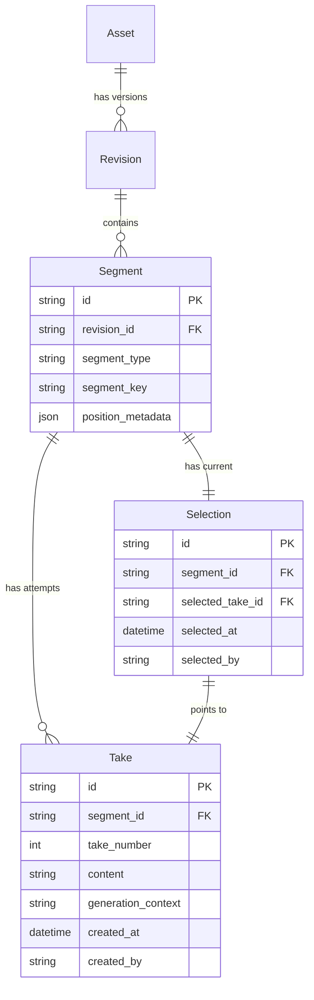
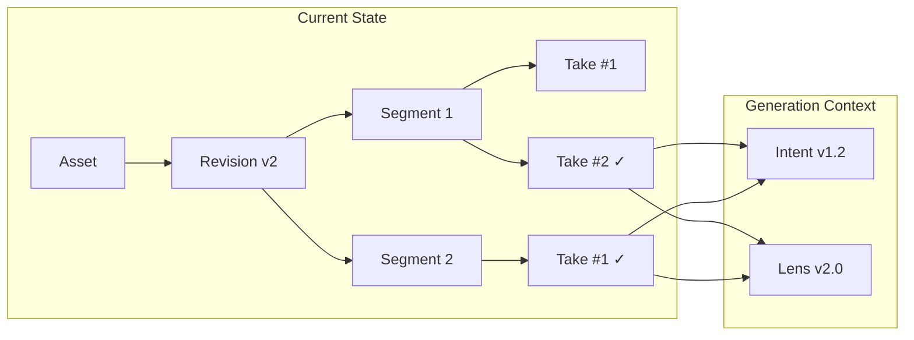

# Asset Provenance Architecture

> **Version**: 1.0
> **Last Updated**: 2026-01-31
> **Status**: Design specification

This document describes the **segment-level provenance model** for AI-generated content in Mindscape AI. Unlike traditional file-level version control, Mindscape tracks content at the **Segment** level, enabling fine-grained rollback, comparison, and governance.

---

## 1. The Problem We're Solving

### Traditional AI Tools

Most AI generation tools operate like this:

```
Input Prompt → AI → Output (as a single blob)
                      ↓
                "Here's your article/video/code"
                      ↓
          If wrong: regenerate everything
```

**Problems**:
- No visibility into which parts of the output are good vs. bad
- Rollback = regenerate everything
- No way to say "keep paragraphs 1-3, redo paragraph 4"
- No audit trail for individual content segments

### Mindscape Approach

```
Input (Intent + Lens) → AI → Segments (tracked individually)
                              ↓
                    Segment 1: Take #1, #2, #3 ← Selection
                    Segment 2: Take #1, #2     ← Selection
                    Segment 3: Take #1         ← Selection
                              ↓
              Rollback = switch Selection (no data lost)
```

---

## 2. Core Data Model

### 2.1 Five-Layer Hierarchy

```
┌─────────────────────────────────────────────────────────────────┐
│                          Asset                                   │
│  (Top-level content unit: document, video, codebase, etc.)      │
├─────────────────────────────────────────────────────────────────┤
│                         Revision                                 │
│  (A version of the Asset, created on meaningful updates)        │
├─────────────────────────────────────────────────────────────────┤
│                         Segment                                  │
│  (Independently governable sub-division)                        │
│  Examples:                                                       │
│    - Text: paragraph, section, chapter                          │
│    - Audio/Video: time range (e.g., 35s-78s)                    │
│    - Code: function, class, file block                          │
├─────────────────────────────────────────────────────────────────┤
│                          Take                                    │
│  (A single generation attempt for a Segment)                    │
│  Multiple Takes can exist for the same Segment                   │
├─────────────────────────────────────────────────────────────────┤
│                        Selection                                 │
│  (The currently chosen Take for a Segment)                      │
│  "Rollback" = switch Selection to a different Take              │
└─────────────────────────────────────────────────────────────────┘
```

### 2.2 Entity Relationships



---

## 3. Segment Types

Different content types have different natural segment boundaries:

### 3.1 Text Segments

| Segment Type | Granularity | Example |
|--------------|-------------|---------|
| `paragraph` | Single paragraph | A blog section |
| `section` | Heading + content | Chapter 3 of a book |
| `field` | Form field | Product description |
| `block` | Semantic block | FAQ item |

### 3.2 Audio/Video Segments

| Segment Type | Granularity | Example |
|--------------|-------------|---------|
| `time_range` | Start/end timestamp | 00:35 - 01:18 |
| `chapter` | Logical chapter | "Introduction" section |
| `track` | Audio track | Background music |
| `scene` | Video scene | Opening sequence |

**Position Metadata Example**:
```json
{
  "segment_type": "time_range",
  "start_ms": 35000,
  "end_ms": 78000,
  "duration_ms": 43000
}
```

### 3.3 Code Segments

| Segment Type | Granularity | Example |
|--------------|-------------|---------|
| `function` | Single function | `calculate_score()` |
| `class` | Class definition | `UserService` |
| `block` | Code block | Initialization block |
| `file` | Entire file | `utils.py` |

---

## 4. Take Management

### 4.1 Take Lifecycle

```
┌─────────────┐     ┌─────────────┐     ┌─────────────┐
│   Generate  │────▶│    Store    │────▶│   Compare   │
│   (AI call) │     │   as Take   │     │   Takes     │
└─────────────┘     └─────────────┘     └─────────────┘
                                              │
                                              ▼
                    ┌─────────────┐     ┌─────────────┐
                    │   Rollback  │◀────│   Select    │
                    │  (if needed)│     │    Take     │
                    └─────────────┘     └─────────────┘
```

### 4.2 Take Metadata

Each Take stores:

```json
{
  "id": "take-uuid",
  "segment_id": "segment-uuid",
  "take_number": 3,
  "content": "...",
  "generation_context": {
    "intent_version": "v1.2",
    "lens_version": "v2.0",
    "prompt_hash": "abc123",
    "model": "gpt-4",
    "temperature": 0.7,
    "timestamp": "2026-01-31T10:00:00Z"
  },
  "quality_signals": {
    "human_rating": null,
    "auto_eval_score": 0.85,
    "regression_test_passed": true
  },
  "created_at": "2026-01-31T10:00:00Z",
  "created_by": "playbook:content_drafting"
}
```

---

## 5. Selection-Based Rollback

### 5.1 Why Selection-Based?

Traditional rollback:
```
v1 → v2 → v3 (current)
         ↓ rollback
v1 → v2 (v3 deleted or archived)
```

Selection-based rollback:
```
Segment:
  ├── Take #1
  ├── Take #2
  └── Take #3 ← Selection (current)
               ↓ rollback
  ├── Take #1
  ├── Take #2 ← Selection (now current)
  └── Take #3 (still exists, can re-select)
```

**Benefits**:
- **No data loss**: All Takes are preserved
- **A/B comparison**: Easy to compare different Takes
- **Audit trail**: Full history of all attempts
- **Re-selection**: Can go back to any Take at any time

### 5.2 Rollback Operations

| Operation | Scope | Description |
|-----------|-------|-------------|
| `select_take(segment_id, take_id)` | Single segment | Switch Selection to a specific Take |
| `rollback_segment(segment_id, take_number)` | Single segment | Switch to Take by number |
| `rollback_revision(revision_id, timestamp)` | Entire revision | Restore all Selections to a timestamp |
| `bulk_rollback(segment_ids, take_criteria)` | Multiple segments | Batch rollback with criteria |

---

## 6. Provenance Queries

### 6.1 Traceability Questions

The provenance model enables answering:

1. **"Why does this segment say X?"**
   ```
   Query: segment → selection → take → generation_context → intent + lens + prompt
   ```

2. **"What changed between Tuesday and today?"**
   ```
   Query: Compare selections at timestamp T1 vs T2
   ```

3. **"Which segments used Lens v1.0?"**
   ```
   Query: takes WHERE generation_context.lens_version = 'v1.0'
   ```

4. **"How many Takes did we discard for this segment?"**
   ```
   Query: takes WHERE segment_id = X AND NOT is_selected
   ```

### 6.2 Provenance Graph



---

## 7. Integration with Governance Layer

### 7.1 Asset Governance in the Four-Layer Stack

```
┌─────────────────────────────────────────┐
│         Intent Governance               │  "Why are we doing this?"
├─────────────────────────────────────────┤
│         Lens Governance                 │  "How should AI behave?"
├─────────────────────────────────────────┤
│         Trust Governance                │  "Is this safe to run?"
├─────────────────────────────────────────┤
│       ★ Asset Governance ★              │  "How did this content evolve?"
│   - Segment-level provenance            │
│   - Take/Selection management           │
│   - Rollback operations                 │
└─────────────────────────────────────────┘
```

### 7.2 Linking to Intent and Lens

Each Take records:
- Which Intent version triggered the generation
- Which Lens was applied
- The compiled prompt that was sent to the LLM

This enables:
- **Impact analysis**: "If I change Lens v2.0, which segments are affected?"
- **Regression detection**: "Did the new Intent produce worse Takes?"
- **Audit compliance**: "Prove that content X was generated under policy Y"

---

## 8. Implementation Status

### Current Implementation (local-core)

| Component | Status | Notes |
|-----------|--------|-------|
| Asset/Revision model | 🟡 Partial | Workspace events store basic versioning |
| Segment model | 🔴 Not yet | Planned for v2.1 |
| Take/Selection model | 🔴 Not yet | Planned for v2.1 |
| Provenance queries | 🔴 Not yet | Planned for v2.1 |
| UI for Take comparison | 🔴 Not yet | Planned for v2.2 |

### Planned Integration Points

1. **Playbook Runner**: Automatically create Takes when generating content
2. **Web Console**: UI for viewing/comparing Takes and switching Selections
3. **API**: REST endpoints for provenance queries
4. **Export**: Include provenance metadata in exported assets

---

## 9. API Design (Planned)

### 9.1 Take Management

```http
# List Takes for a Segment
GET /api/v1/assets/{asset_id}/segments/{segment_id}/takes

# Get specific Take
GET /api/v1/takes/{take_id}

# Select a Take (set as current)
POST /api/v1/segments/{segment_id}/select
{
  "take_id": "take-uuid"
}
```

### 9.2 Provenance Queries

```http
# Get generation context for a Take
GET /api/v1/takes/{take_id}/provenance

# Find segments by Lens version
GET /api/v1/provenance/query?lens_version=v2.0

# Diff Selections between timestamps
GET /api/v1/assets/{asset_id}/diff?from=2026-01-01&to=2026-01-31
```

---

## 10. Related Documents

- [Governance Decision & Risk Control Layer](./governance-decision-risk-control-layer.md)
- [Mind-Model VC](./mind-model-vc.md)
- [Glossary: Asset Provenance Terms](../getting-started/glossary.md#asset-provenance-concepts)
- [Brand: Asset Provenance Design](file:///Users/shock/Projects_local/workspace/site-brand/sites/mindscape-ai/brand/product-design/05-asset-provenance.md)
