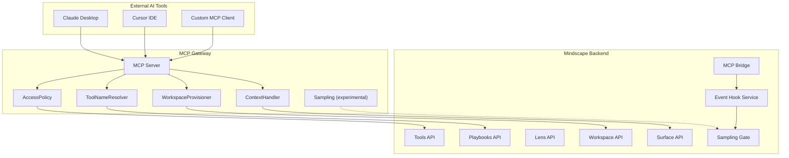
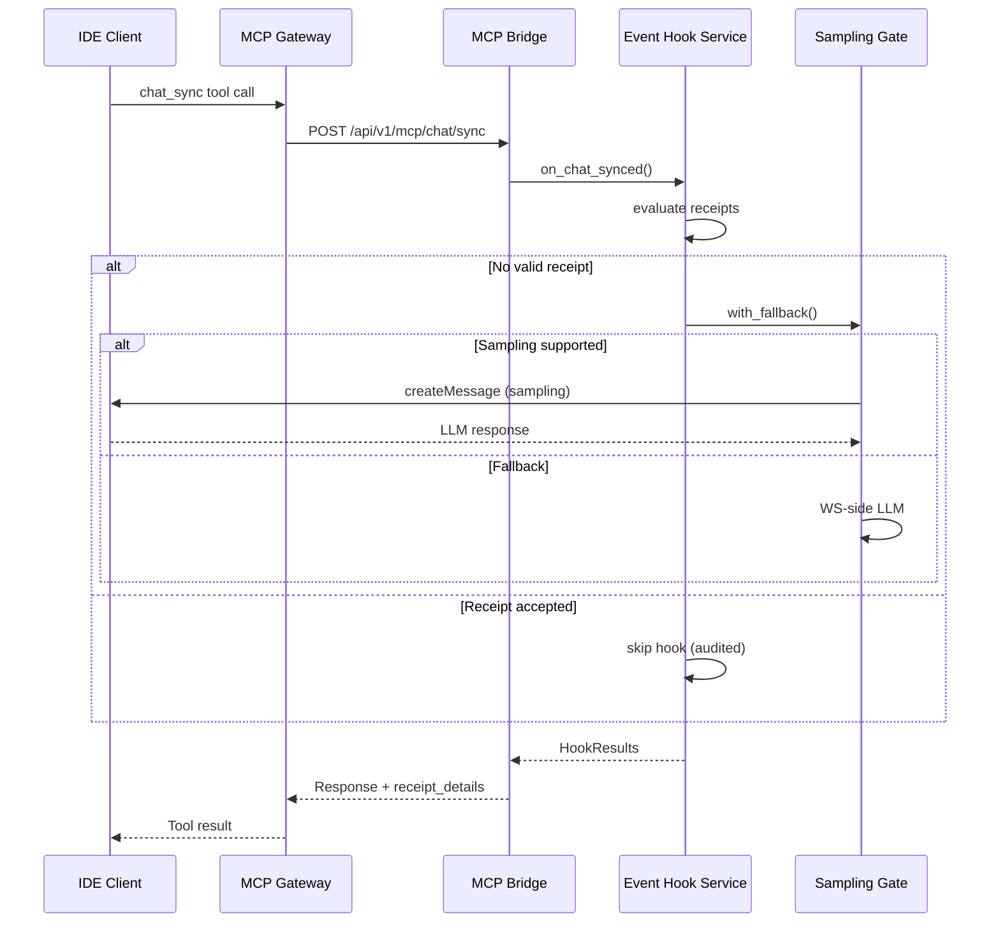

# MCP Gateway Architecture

> Model Context Protocol (MCP) Gateway for exposing Mindscape AI capabilities to external AI tools.

## Overview

The MCP Gateway serves as a bridge between external AI tools (Claude Desktop, Cursor IDE, custom integrations) and the Mindscape AI Local Core. It exposes Mindscape's governed tool system through the standardized MCP protocol, with server-initiated sampling capabilities and evented hook infrastructure.



## Key Components

### 1. ToolNameResolver

Converts between internal Mindscape naming (`pack.action`) and MCP-compliant naming (`mindscape_layer_pack_action`).

```typescript
// Internal: wordpress.get_posts
// MCP:      mindscape_tool_wordpress_get_posts
```

**Why underscores?** MCP protocol only allows `[a-zA-Z0-9_-]` in tool names, prohibiting dots.

### 2. WorkspaceProvisioner (P0)

Auto-provisions workspaces for external tools, eliminating the need for pre-configured workspace IDs.

```typescript
// Priority order:
// 1. Explicit MINDSCAPE_WORKSPACE_ID
// 2. Cached workspace ID
// 3. Search existing workspace by title
// 4. Auto-create new workspace (if enabled)
```

### 3. AccessPolicy

Three-layer governance routing:

| Layer | Prefix | Description | Example |
|-------|--------|-------------|---------|
| Primitive | `mindscape_tool_` | Low-risk, read-only operations | `mindscape_tool_wordpress_get_posts` |
| Macro | `mindscape_playbook_` | Orchestrated workflows | `mindscape_playbook_creative_blog_post` |
| Governed | `mindscape_run_` | High-risk, requires confirmation | `mindscape_run_wordpress_delete_post` |

### 4. ContextHandler (P3)

Enables external tools to pass conversation context for Intent/Seed tracking.

```json
{
  "name": "mindscape_playbook_creative_blog_post",
  "arguments": {
    "workspace_id": "...",
    "_context": {
      "original_message": "Write a yoga blog post",
      "surface_type": "claude_desktop",
      "surface_user_id": "user@example.com"
    },
    "inputs": { "topic": "yoga" }
  }
}
```

---

## MCP Bridge (Backend API)

The MCP Bridge (`backend/app/routes/mcp_bridge.py`) acts as the backend counterpart to the MCP Gateway, providing dedicated API routes for IDE-to-core communication.

### Endpoints

| Method | Path | Description |
|--------|------|-------------|
| `POST` | `/api/v1/mcp/chat/sync` | Synchronous chat with automatic side-effects |
| `POST` | `/api/v1/mcp/intent/submit` | Submit extracted intent signals |
| `POST` | `/api/v1/mcp/project/detect` | Detect or create project contexts |
| `GET` | `/api/v1/mcp/health` | Bridge health check |

### chat_sync Flow

The primary endpoint `/api/v1/mcp/chat/sync` performs:

1. **Message recording** - persists each message as a timeline event
2. **Event hook execution** - triggers idempotent side-effects (intent extraction, steward analysis)
3. **Receipt-based override** - skips hooks when IDE provides valid execution receipts
4. **Response enrichment** - returns thread metadata, hook results, and receipt decisions



---

## Event Hook Service

`backend/app/services/mcp_event_hooks.py` is the backbone of MCP-triggered side-effects, enforcing four governance invariants:

### Governance Invariants

| # | Invariant | Implementation |
|---|-----------|----------------|
| 1 | **Evented** | All actions emit to `mcp_events` table |
| 2 | **Idempotent** | `mcp_hook_runs` table with idempotency keys prevents duplicate execution |
| 3 | **Receipts over Claims** | `_evaluate_receipt()` validates IDE-provided execution receipts before skipping hooks |
| 4 | **Policy Gates** | `_gate()` checks step-level policy against configurable enabled hooks set |

### Receipt Validation Rules

When an IDE claim "I already extracted intents", the receipt must pass all validation rules:

1. Receipt must exist for the step
2. `trace_id` must be non-empty
3. `output_hash` must be valid hex string (minimum 16 characters)
4. `completed_at` must not be in the future

Failed validation results in the hook executing normally, with a `receipt_rejected` audit event logged.

### Database Schema

Two tables support the event hook infrastructure:

**`mcp_events`** - Audit log for all MCP-originated events:

| Column | Type | Description |
|--------|------|-------------|
| `id` | UUID | Primary key |
| `event_type` | VARCHAR(100) | Event classification |
| `source` | VARCHAR(50) | Origin service |
| `workspace_id` | VARCHAR(100) | Workspace scope |
| `trace_id` | VARCHAR(100) | Correlation identifier |
| `payload` | JSONB | Event data |
| `created_at` | TIMESTAMP | Event timestamp |

**`mcp_hook_runs`** - Idempotency tracking:

| Column | Type | Description |
|--------|------|-------------|
| `id` | UUID | Primary key |
| `idempotency_key` | VARCHAR(255) | Unique dedup key |
| `hook_name` | VARCHAR(100) | Hook identifier |
| `workspace_id` | VARCHAR(100) | Workspace scope |
| `status` | VARCHAR(20) | `pending` / `completed` / `failed` |
| `result_payload` | JSONB | Execution result |
| `created_at` | TIMESTAMP | Start time |
| `completed_at` | TIMESTAMP | Completion time |

Migration: `backend/alembic_migrations/versions/20260211000000_add_mcp_events_and_hook_runs.py`

---

## Sampling Gate

`backend/app/services/sampling_gate.py` controls server-initiated LLM calls to the IDE client via MCP Sampling.

### Three-Tier Fallback

```text
Tier 1: MCP Sampling (server.createMessage -> IDE LLM)
  | fail / timeout / unsupported
  v
Tier 2: WS-side LLM (local intent extractor)
  | fail
  v
Tier 3: Pending card (manual review placeholder)
```

### Safety Controls

| Control | Description |
|---------|-------------|
| **Template Allowlist** | Only `intent_extract`, `steward_analyze`, `plan_build` templates permitted |
| **Rate Limit** | 10 requests per workspace per 60-second sliding window |
| **PII Redaction** | Email and phone patterns redacted before sampling |
| **Timeout** | 30-second timeout with automatic fallback |

### Sampling Capability

The gateway declares sampling support via `experimental.sampling` in server capabilities. When the IDE client supports sampling, `server.createMessage()` sends structured prompts to the client's LLM for processing, reducing WS-side LLM costs.

---

## Gateway Tool Definitions

### Intent Tools (`mcp-mindscape-gateway/src/tools/intent_tools.ts`)

| Tool | Description |
|------|-------------|
| `mindscape_intent_extract` | Extract intent signals from conversation text |
| `mindscape_intent_submit` | Submit intent signals to backend |

### Chat Sync Tools (`mcp-mindscape-gateway/src/tools/chat_sync_tools.ts`)

| Tool | Description |
|------|-------------|
| `mindscape_chat_sync` | Synchronous chat with backend, returns hook results |

Supports `ide_receipts` array for receipt-based override.

### Project Tools (`mcp-mindscape-gateway/src/tools/project_tools.ts`)

| Tool | Description |
|------|-------------|
| `mindscape_project_detect` | Detect or create project context from conversation |

---

## Tool Schema

All tools use a unified schema format:

```typescript
{
  workspace_id: string,          // Required: Mindscape workspace
  inputs: Record<string, any>,   // Tool-specific parameters
  _context?: {                   // Optional: External context
    original_message?: string,
    surface_type?: string,
    surface_user_id?: string,
    conversation_id?: string,
    intent_hint?: string
  },
  confirm_token?: string         // Required for governed tools
}
```

## Configuration

### Environment Variables

| Variable | Description | Default |
|----------|-------------|---------|
| `MINDSCAPE_BASE_URL` | Backend API URL | `http://localhost:8000` |
| `MINDSCAPE_WORKSPACE_ID` | Pre-configured workspace | (auto-provision) |
| `MINDSCAPE_PROFILE_ID` | User profile ID | `default-user` |
| `MINDSCAPE_AUTO_PROVISION` | Enable auto-workspace creation | `true` |
| `MINDSCAPE_GATEWAY_MODE` | `single_workspace` or `multi_workspace` | `single_workspace` |

### Multi-Workspace Mode

When `MINDSCAPE_GATEWAY_MODE=multi_workspace`, each `surface_user_id` gets its own workspace automatically.

## Integration with Claude Desktop

```json
{
  "mcpServers": {
    "mindscape": {
      "command": "/path/to/mcp-mindscape-gateway/run.sh",
      "env": {
        "MINDSCAPE_BASE_URL": "http://localhost:8200"
      }
    }
  }
}
```

## Security Considerations

1. **Internal tools never exposed**: Tools matching `internal_`, `migrate`, `debug`, `admin` are blocked.
2. **Governed operations require confirmation**: Delete, update, publish operations need `confirm_token`.
3. **Rate limiting**: Per-tool call rate limits can be configured.
4. **Sampling safety gate**: Only allowlisted templates can trigger server-to-client LLM calls, with PII redaction and rate limits.

## File Reference

| Component | Path | Lines |
|-----------|------|-------|
| MCP Bridge routes | `backend/app/routes/mcp_bridge.py` | ~350 |
| Event Hook Service | `backend/app/services/mcp_event_hooks.py` | ~680 |
| Sampling Gate | `backend/app/services/sampling_gate.py` | ~310 |
| DB Migration | `backend/alembic_migrations/versions/20260211000000_add_mcp_events_and_hook_runs.py` | ~90 |
| Gateway Index | `mcp-mindscape-gateway/src/index.ts` | ~510 |
| Intent Tools | `mcp-mindscape-gateway/src/tools/intent_tools.ts` | ~120 |
| Chat Sync Tools | `mcp-mindscape-gateway/src/tools/chat_sync_tools.ts` | ~180 |
| Project Tools | `mcp-mindscape-gateway/src/tools/project_tools.ts` | ~100 |

## Related Documentation

- [Surface & Command Bus](./surface-command-bus.md)
- [Adapter Compilation Guide](../contributor-guide/adapter-compilation-guide.md)
- [MCP Gateway README](../../mcp-mindscape-gateway/README.md)
