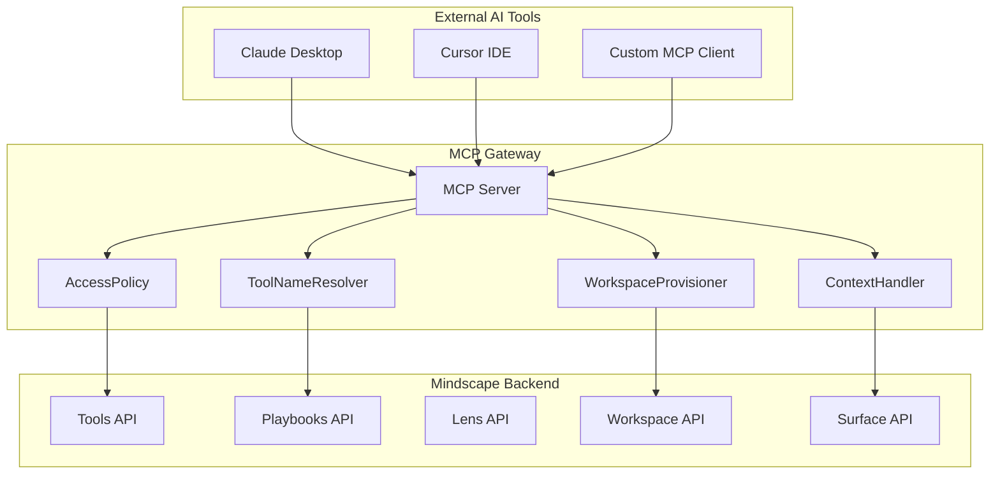

# MCP Gateway Architecture

> Model Context Protocol (MCP) Gateway for exposing Mindscape AI capabilities to external AI tools.

## Overview

The MCP Gateway serves as a bridge between external AI tools (Claude Desktop, Cursor IDE, custom integrations) and the Mindscape AI Local Core. It exposes Mindscape's governed tool system through the standardized MCP protocol.



## Key Components

### 1. ToolNameResolver

Converts between internal Mindscape naming (`pack.action`) and MCP-compliant naming (`mindscape_layer_pack_action`).

```typescript
// Internal: wordpress.get_posts
// MCP:      mindscape_tool_wordpress_get_posts
```

**Why underscores?** MCP protocol only allows `[a-zA-Z0-9_-]` in tool names, prohibiting dots.

### 2. WorkspaceProvisioner (P0)

Auto-provisions workspaces for external tools, eliminating the need for pre-configured workspace IDs.

```typescript
// Priority order:
// 1. Explicit MINDSCAPE_WORKSPACE_ID
// 2. Cached workspace ID
// 3. Search existing workspace by title
// 4. Auto-create new workspace (if enabled)
```

### 3. AccessPolicy

Three-layer governance routing:

| Layer | Prefix | Description | Example |
|-------|--------|-------------|---------|
| Primitive | `mindscape_tool_` | Low-risk, read-only operations | `mindscape_tool_wordpress_get_posts` |
| Macro | `mindscape_playbook_` | Orchestrated workflows | `mindscape_playbook_creative_blog_post` |
| Governed | `mindscape_run_` | High-risk, requires confirmation | `mindscape_run_wordpress_delete_post` |

### 4. ContextHandler (P3)

Enables external tools to pass conversation context for Intent/Seed tracking.

```typescript
// Tool call with context
{
  "name": "mindscape_playbook_creative_blog_post",
  "arguments": {
    "workspace_id": "...",
    "_context": {
      "original_message": "Write a yoga blog post",
      "surface_type": "claude_desktop",
      "surface_user_id": "user@example.com"
    },
    "inputs": { "topic": "yoga" }
  }
}
```

## Tool Schema

All tools use a unified schema format:

```typescript
{
  workspace_id: string,          // Required: Mindscape workspace
  inputs: Record<string, any>,   // Tool-specific parameters
  _context?: {                   // Optional: External context (P3)
    original_message?: string,
    surface_type?: string,
    surface_user_id?: string,
    conversation_id?: string,
    intent_hint?: string
  },
  confirm_token?: string         // Required for governed tools
}
```

## Configuration

### Environment Variables

| Variable | Description | Default |
|----------|-------------|---------|
| `MINDSCAPE_BASE_URL` | Backend API URL | `http://localhost:8000` |
| `MINDSCAPE_WORKSPACE_ID` | Pre-configured workspace | (auto-provision) |
| `MINDSCAPE_PROFILE_ID` | User profile ID | `default-user` |
| `MINDSCAPE_AUTO_PROVISION` | Enable auto-workspace creation | `true` |
| `MINDSCAPE_GATEWAY_MODE` | `single_workspace` or `multi_workspace` | `single_workspace` |

### Multi-Workspace Mode

When `MINDSCAPE_GATEWAY_MODE=multi_workspace`, each `surface_user_id` gets its own workspace automatically.

## Integration with Claude Desktop

```json
{
  "mcpServers": {
    "mindscape": {
      "command": "/path/to/mcp-mindscape-gateway/run.sh",
      "env": {
        "MINDSCAPE_BASE_URL": "http://localhost:8200"
      }
    }
  }
}
```

## Security Considerations

1. **Internal tools never exposed**: Tools matching `internal_`, `migrate`, `debug`, `admin` are blocked.
2. **Governed operations require confirmation**: Delete, update, publish operations need `confirm_token`.
3. **Rate limiting**: Per-tool call rate limits can be configured.

## Related Documentation

- [Surface & Command Bus](./surface-command-bus.md)
- [Adapter Compilation Guide](../contributor-guide/adapter-compilation-guide.md)
- [MCP Gateway README](../../mcp-mindscape-gateway/README.md)
