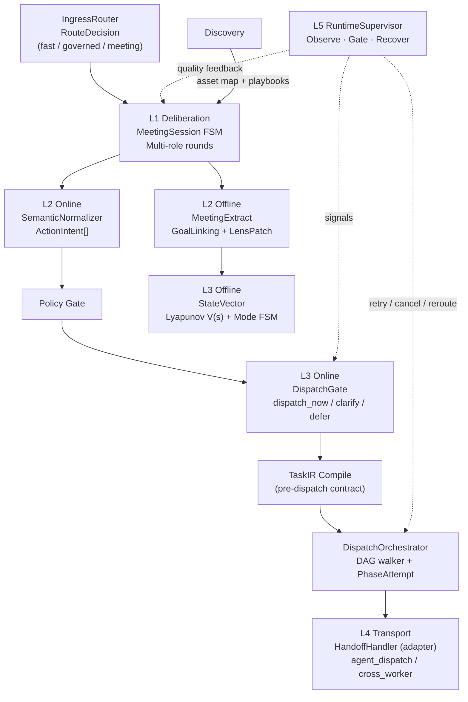

# Mind Meeting — Five-Layer Architecture

**Created**: 2026-02-08
**Last Updated**: 2026-03-08
**Status**: v3.1 — Routing stabilization (Phase 0) + runtime supervision upgrade in progress
**Scope**: `mindscape-ai-local-core` Meeting Engine

> The Mind Meeting system inherits from the Mindscape Node Graph (Mind Canvas) and extends it into a governed, convergence-driven meeting engine. The five layers form a unified pipeline from deliberation through supervision, fronted by a single ingress routing layer.

---

## Architecture Overview

### Ingress Routing + Five-Layer Pipeline

### Plane Separation

| Plane | State | Writer | Reader |
|-------|-------|--------|--------|
| **Control** | TaskIR, PhaseAttempt, DispatchEvent | DispatchOrchestrator | L5 RuntimeSupervisor |
| **Projection** | tasks, playbook_executions | Projection writer (from Control) | API consumers, UI |
| **Transport** | pending_dispatch, ws_connections | L4 adapters | agent_dispatch, cross_worker |

> [!IMPORTANT]
> Projection State is write-only from Control — no read-back. L5 reads Control State only.

---

## Ingress Routing (Phase 0)

All entry points — chat, handoff-bundle compile, API intake — pass through a single `IngressRouter` that produces a `RouteDecision`.

### RouteDecision

| Field | Values | Purpose |
|-------|--------|---------|
| `route_kind` | `fast`, `governed`, `meeting` | Which primary path |
| `execution_profile` | `simple`, `durable` | Runtime profile (orthogonal axis) |
| `reason_codes` | list of strings | Why this path was chosen |
| `escalation_allowed` | bool | Can this request be upgraded later |

> [!IMPORTANT]
> `route_kind` and `execution_profile` are separate axes, not conflated. `meeting` + `simple` and `fast` + `durable` are both valid combinations.

### RouteTransition

Any path promotion after ingress (e.g., `fast → meeting`) is represented as an explicit `RouteTransition` record, not a hidden post-response upgrade.

---

## L1 — Deliberation

The meeting session FSM drives multi-role rounds:

| Role | Responsibility |
| --- | --- |
| Facilitator | Synthesize progress, judge convergence |
| Planner | Propose executable plans |
| Critic | Challenge assumptions, identify risks |
| Executor | Convert decisions into action items |

> [!NOTE]
> Meeting roles are **deliberation roles**, not AgentSpec identities. A single LLM call can play any role; the role defines prompt framing, not agent identity.

**Round loop**: Facilitator → Planner → Critic → Facilitator (cycle). Convergence is reached when the facilitator emits `[CONVERGED]` or max rounds are hit.

---

## L2 — Semantic Bridge

### L2-Online: Semantic Normalizer

Runs synchronously in the dispatch path. Converts raw executor JSON into typed `ActionIntent[]`:

1. **Parse** — Extract structured fields from executor output
2. **Mint intent_id** — UUID, assigned once and immutable (not derived from mutable fields)
3. **Resolve** — Tool/playbook/workspace lookup, confidence scoring

### L2-Offline: Analysis Chain

Runs asynchronously, never blocks dispatch:

1. **MeetingExtract** — classify events into DECISION / ACTION / RISK items
2. **GoalLinking** — align extract items to goal clauses (Jaccard keyword overlap)
3. **Persist** — store to `MeetingExtractStore`
4. **LensPatch** — compute lens differential (before/after meeting)
5. **StateVector** — feed into L3-Offline convergence computation

---

## L3 — Convergence + Dispatch Gate

### L3-Online: Dispatch Gate

Accepts `ActionIntent[]` + L5 supervision signals → per-intent decision:

| Decision | Meaning |
|----------|---------|
| `dispatch_now` | Compile to TaskIR and execute |
| `clarify` | Loop back to L1, request more information |
| `split` | Decompose compound intent |
| `defer` | Risk budget exhausted, postpone |

### L3-Offline: Convergence Engine

The self-evolving convergence engine treats the meeting as a constrained dynamical system.

**State vector**: `s_t = (progress, evidence, risk, drift)` — four axes.

**Lyapunov stability**: `V(s) = 0.3*risk + 0.2*drift - 0.3*progress - 0.2*evidence`. Decreasing V means convergence.

**Mode FSM** (four modes):

| Mode | Entry Condition |
| --- | --- |
| EXPLORE | Initial state |
| CONVERGE | evidence >= 0.5 and progress >= 0.3 |
| DELIVER | progress >= 0.7 and risk <= 0.3 |
| DEBUG | risk >= 0.7 (from any mode) |

---

## TaskIR — Pre-Dispatch Contract

TaskIR is compiled **before** dispatch, not post-hoc.

### Compile Invariants

| # | Invariant | Rule |
|---|-----------|------|
| INV-1 | `intent_id` is minted UUID | Assigned once by L2-Online, never re-derived |
| INV-2 | `phase_id = intent_id` | 1:1 mapping, no synthetic IDs |
| INV-3 | Recompilation is safe | Same `ActionIntent[]` → same TaskIR (idempotent) |
| INV-4 | `depends_on` is passthrough | Only explicit dependencies, no auto-sequential |

### Policy Gate

Executes between L2-Online and L3-Online:

| Reason Code | Trigger | Status |
| --- | --- | --- |
| `UNKNOWN_PLAYBOOK` | playbook_code not in installed list | Implemented |
| `TOOL_NOT_ALLOWED` | tool_name not in workspace allowlist | Pending |
| `WORKSPACE_BOUNDARY` | target workspace outside DataLocality scope | Implemented |

---

## DispatchOrchestrator (L3-Online → L4)

Single dispatch authority. Replaces direct `_land_action_item()` dispatch and `pipeline_core.dispatch_task_ir()`.

1. **DAG walk** — Traverse PhaseIR dependency graph
2. **Dependency gate** — Skip downstream if upstream fails (configurable per phase)
3. **PhaseAttempt lifecycle** — Create attempt record, track status
4. **Adapter routing** — Select HandoffHandler adapter (playbook / tool / IDE WS)
5. **Projection write** — Update `tasks` table (backward compat) in same transaction

### DispatchCommandBus

> [!NOTE]
> `DispatchCommandBus` is the meeting engine's internal dispatch queue (DB `pending_dispatch`). It is **not** the Surface `CommandBus` described in [surface-command-bus.md](./surface-command-bus.md).

---

## L4 — Transport

`agent_dispatch` is scoped as an **IDE WS executor adapter** — transport only, no route authority, no meeting semantics.

### Task Type Dispatch

| Condition | task_type | Execution Path |
| --- | --- | --- |
| `playbook_code` present | `playbook_execution` | `PlaybookRunExecutor` |
| `tool_name` present | `tool_execution` | `UnifiedToolExecutor` |
| Neither | `meeting_action_item` | No auto-execution |

### HandoffHandler

Downstream adapter-selection layer. Receives dispatch commands from DispatchOrchestrator, selects the appropriate executor adapter. No independent routing authority.

---

## L5 — Runtime Supervision

L5 is a **boundary-event-driven supervisor** that operates across all layers. It is not a per-layer content reviewer.

### Three Intervention Modes

| Mode | When | What |
|------|------|------|
| **Observe** | Always | Read events, states, metrics — no flow changes |
| **Gate** | Synchronous boundaries | Admission decisions (concurrent dispatch limit, risk budget) |
| **Recover** | Runtime failures | Retry, cancel, reroute, schedule follow-up meeting |

### Per-Layer Observation

| Layer | L5 observes | L5 does NOT do |
|-------|------------|----------------|
| L1 | Round count, convergence trend, repetition | Re-judge content, act as second facilitator |
| L2 | Schema completeness, confidence scores, policy hits | Re-run normalization |
| L3 | Gate decisions, deferred count, risk budget | Override gate decisions |
| L4 | PhaseAttempt progress, stuck detection, timeout | Execute tasks directly |

### Supervision Signals → L3

`RuntimeSupervisor` emits `SupervisionSignals` consumed by the L3 Dispatch Gate:
- Risk budget remaining
- Retry budget remaining
- Historical failure rate per workspace/tool

### Post-Mortem (Backward Compat)

| Method | Purpose |
| --- | --- |
| `on_session_closed(session_id)` | Check dispatch outcomes, compute tool coverage |
| `check_stuck_tasks(session_id, threshold)` | Find tasks that haven't progressed |
| `score_session(session_id)` | Compute quality score (completed/total) |

---

## Workspace Discovery

### Visibility

`WorkspaceVisibility` enum controls which workspaces appear in meeting asset maps:

| Value | Meaning |
| --- | --- |
| `private` | Only visible to owner |
| `group` | Visible to group members |
| `discoverable` | Injected into meeting asset maps |
| `public` | Visible to all |

### Workspace Groups

Workspace groups define collaboration topology.

| Role | Meaning |
| --- | --- |
| `dispatch` | Coordination workspace |
| `cell` | Execution workspace |

**API Endpoints**:

- `GET /api/v1/workspace-groups/{group_id}` — Group details and member list
- `GET /api/v1/workspace-groups/{group_id}/members` — Member list only

### Discovery Injection

Meeting asset maps dynamically query workspaces with `visibility=discoverable` and inject them into the facilitator prompt, enabling cross-workspace awareness during deliberation.

---

## Data Contracts

| Object | Purpose | Key Fields |
| --- | --- | --- |
| `RouteDecision` | Ingress routing output | route_kind, execution_profile, reason_codes |
| `RouteTransition` | Explicit path promotion | from_kind, to_kind, reason |
| `ActionIntent` | Typed executor output | intent_id (UUID), tool/playbook, confidence |
| `MeetingSession` | Session lifecycle container | status FSM, state snapshots |
| `MeetingExtract` | Structured items from events | extract type, confidence, evidence refs |
| `StateVector` | Four-axis convergence state | progress, evidence, risk, drift, lyapunov_v, mode |
| `TaskIR` / `PhaseIR` | Pre-dispatch execution contract | phase_id, tool_name, input_params, depends_on |
| `PhaseAttempt` | Per-phase execution tracking | attempt_number, status FSM, adapter_id |
| `DispatchEvent` | Append-only dispatch log | event_type, phase_id, timestamp |
| `SupervisionSignals` | L5 → L3 signals | risk_budget, retry_budget, failure_rate |
| `WorkspaceGroup` | Group topology | display_name, role_map, owner_user_id |

---

## Architecture Invariants

| # | Invariant | Rationale |
| --- | --- | --- |
| R-1 | Every ingress request yields one `RouteDecision` | Single routing vocabulary |
| R-2 | `route_kind` and `execution_profile` are orthogonal | Prevents vocabulary collision |
| INV-1 | `intent_id` is minted UUID, immutable | Stable across recompilation |
| INV-2 | `phase_id = intent_id` | 1:1, no synthetic IDs |
| INV-3 | TaskIR recompilation is idempotent | Same input → same output |
| INV-4 | `depends_on` is explicit passthrough only | No auto-sequential |
| L3-1 | StateVector four axes are fixed | Prevents dimension bloat |
| L3-2 | V(s) is observational, not a hard gate | Prevents over-constraining |
| L3-4 | No evidence means score * 0.5 (with warm-up) | Prevents reward hacking |
| L4-1 | Policy Gate executes before dispatch gate | All paths protected |
| L4-2 | `blocked_by` uses batch-local indices | Simplifies cross-workspace deps |
| L4-3 | `aggregate_status` dynamically computed | Prevents contradictory states |
| L5-1 | Supervisor is non-fatal (try/except) | Same pattern as L2/L3 |
| L5-2 | L5 reads Control State only, never Projection | Prevents circular dependency |
| S-1 | Control → Projection is write-only | No read-back from projection to control |
| S-2 | Transport State is opaque to Control | agent_dispatch internals don't leak |

---

## Test Coverage

| Suite | Count | Status |
| --- | --- | --- |
| L2 tests | 70 | Pass |
| L3 tests | 51 | Pass |
| Dispatch + Policy Gate | 20 | Pass |
| Dispatch (legacy) | 7 | Pass |
| Supervisor | 10+ | Pass |
| Other orchestration | 16 | Pass |
| **Total** | **174+** | |

