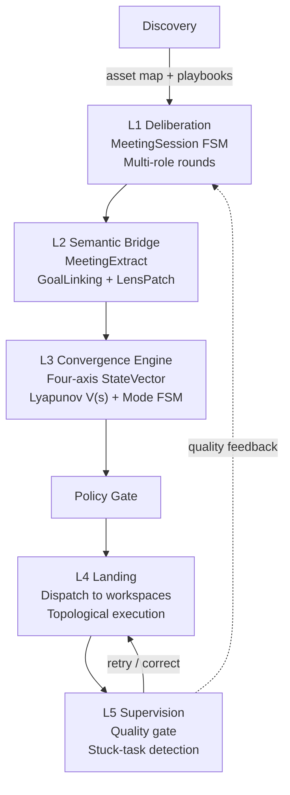

# Mind Meeting — Five-Layer Architecture

**Created**: 2026-02-08
**Last Updated**: 2026-03-01
**Status**: All five layers implemented
**Scope**: `mindscape-ai-local-core` Meeting Engine

> The Mind Meeting system inherits from the Mindscape Node Graph (Mind Canvas) and extends it into a governed, convergence-driven meeting engine. The five layers form a unified pipeline from deliberation through supervision.

---

## Architecture Overview

The five layers operate as a single cohesive pipeline:

---

## L1 — Deliberation

The meeting session FSM drives multi-role rounds:

| Role | Responsibility |
| --- | --- |
| Facilitator | Synthesize progress, judge convergence |
| Planner | Propose executable plans |
| Critic | Challenge assumptions, identify risks |
| Executor | Convert decisions into action items |

**Round loop**: Facilitator -> Planner -> Critic -> Facilitator (cycle). Convergence is reached when the facilitator emits `[CONVERGED]` or max rounds are hit.

---

## L2 — Semantic Bridge

A five-step pipeline converts natural language meeting output into computable structures:

1. **MeetingExtract** — classify events into DECISION / ACTION / RISK items
2. **GoalLinking** — align extract items to goal clauses (Jaccard keyword overlap)
3. **Persist** — store to `MeetingExtractStore`
4. **LensPatch** — compute lens differential (before/after meeting)
5. **StateVector** — feed into L3 convergence computation

---

## L3 — Convergence Engine

The self-evolving convergence engine treats the meeting as a constrained dynamical system.

**State vector**: `s_t = (progress, evidence, risk, drift)` — four axes.

**Lyapunov stability**: `V(s) = 0.3*risk + 0.2*drift - 0.3*progress - 0.2*evidence`. Decreasing V means convergence.

**Mode FSM** (four modes):

| Mode | Entry Condition |
| --- | --- |
| EXPLORE | Initial state |
| CONVERGE | evidence >= 0.5 and progress >= 0.3 |
| DELIVER | progress >= 0.7 and risk <= 0.3 |
| DEBUG | risk >= 0.7 (from any mode) |

---

## L4 — Landing (Dispatch)

Action items from the executor are dispatched to workspaces:

1. **Policy Gate** — check playbook availability, tool allowlist, workspace boundary
2. **Topological Sort** — resolve `blocked_by` dependencies (Kahn's algorithm)
3. **Workspace Grouping** — group by `target_workspace_id`
4. **Execution**:
   - Single-path (<=1 workspace): serial in topological order
   - Multi-path (>1 workspace): DataLocality boundary check, parallel `asyncio.gather`
5. **Fan-in** — aggregate results, compute dynamic `aggregate_status`

### Task Type Dispatch

| Condition | task_type | Execution Path |
| --- | --- | --- |
| `playbook_code` present | `playbook_execution` | `PlaybookRunExecutor` |
| `tool_name` present | `tool_execution` | `UnifiedToolExecutor` |
| Neither | `meeting_action_item` | No auto-execution |

### Policy Gate

| Reason Code | Trigger | Status |
| --- | --- | --- |
| `UNKNOWN_PLAYBOOK` | playbook_code not in installed list | Implemented |
| `TOOL_NOT_ALLOWED` | tool_name not in workspace allowlist | Pending |
| `WORKSPACE_BOUNDARY` | target workspace outside DataLocality scope | Implemented |

---

## L5 — Supervision

Post-session quality gate and stuck-task detection.

| Method | Purpose |
| --- | --- |
| `on_session_closed(session_id)` | Check dispatch outcomes, compute tool coverage |
| `check_stuck_tasks(session_id, threshold)` | Find tasks that haven't progressed |
| `score_session(session_id)` | Compute quality score (completed/total) |

Called at end of `engine.run()`, wrapped in `try/except` (non-fatal, same pattern as L2/L3).

---

## Workspace Discovery

### Visibility

`WorkspaceVisibility` enum controls which workspaces appear in meeting asset maps:

| Value | Meaning |
| --- | --- |
| `private` | Only visible to owner |
| `group` | Visible to group members |
| `discoverable` | Injected into meeting asset maps |
| `public` | Visible to all |

### Workspace Groups

Workspace groups define collaboration topology.

| Role | Meaning |
| --- | --- |
| `dispatch` | Coordination workspace |
| `cell` | Execution workspace |

**API Endpoints**:

- `GET /api/v1/workspace-groups/{group_id}` — Group details and member list
- `GET /api/v1/workspace-groups/{group_id}/members` — Member list only

### Discovery Injection

Meeting asset maps dynamically query workspaces with `visibility=discoverable` and inject them into the facilitator prompt, enabling cross-workspace awareness during deliberation.

---

## Data Contracts

| Object | Purpose | Key Fields |
| --- | --- | --- |
| `MeetingSession` | Session lifecycle container | status FSM, state snapshots |
| `MeetingExtract` | Structured items from events | extract type, confidence, evidence refs |
| `StateVector` | Four-axis convergence state | progress, evidence, risk, drift, lyapunov_v, mode |
| `PhaseIR` | Executable task IR | tool_name, input_params, blocked_by |
| `WorkspaceGroup` | Group topology | display_name, role_map, owner_user_id |

---

## Architecture Invariants

| # | Invariant | Rationale |
| --- | --- | --- |
| L3-1 | StateVector four axes are fixed | Defines complete phase space, prevents dimension bloat |
| L3-2 | V(s) is observational, not a hard gate | Prevents over-constraining viable meetings |
| L3-4 | No evidence means score * 0.5 (with warm-up) | Prevents reward hacking |
| L4-1 | Policy Gate executes before workspace grouping | Ensures all paths are protected |
| L4-2 | `blocked_by` uses batch-local indices | Simplifies cross-workspace dependency tracking |
| L4-3 | `aggregate_status` must be dynamically computed | Prevents contradictory states |
| L5-1 | Supervisor runs in try/except (non-fatal) | Same pattern as L2/L3 pipeline |

---

## Test Coverage

| Suite | Count | Status |
| --- | --- | --- |
| L2 tests | 70 | Pass |
| L3 tests | 51 | Pass |
| Dispatch + Policy Gate | 20 | Pass |
| Dispatch (legacy) | 7 | Pass |
| Supervisor | 10+ | Pass |
| Other orchestration | 16 | Pass |
| **Total** | **174+** | |
