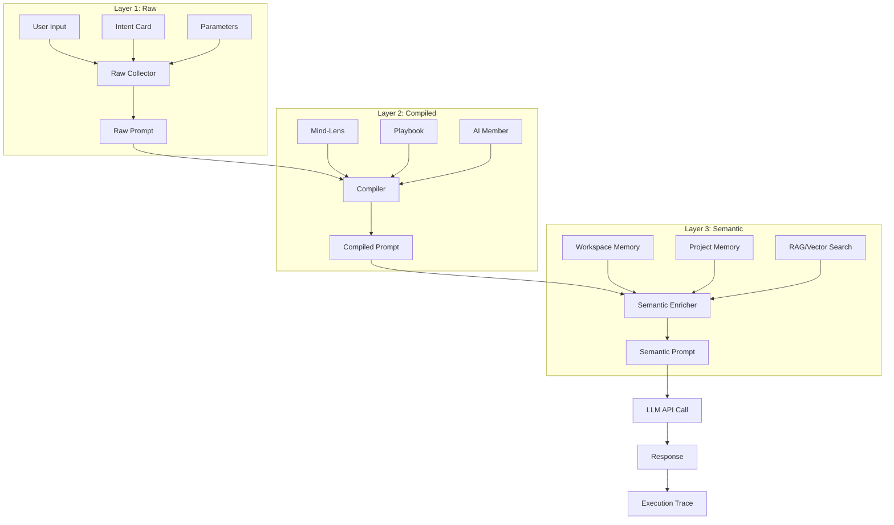

# Prompt Compilation Architecture

> **Version**: 1.0
> **Last Updated**: 2026-01-31
> **Status**: Design specification

This document describes the **three-layer prompt compilation** model in Mindscape AI. Unlike simple prompt templates, Mindscape compiles prompts through multiple stages, enabling traceability, debugging, and governance at each layer.

---

## 1. Overview

### The Problem

Traditional AI applications use prompts like this:

```
User Input + System Prompt → LLM → Response
```

**Problems**:
- No visibility into what was actually sent to the LLM
- Hard to debug: "Why did AI say that?"
- No separation between user intent, style rules, and context
- Changes to one thing affect everything

### Mindscape's Three-Layer Approach

```
┌─────────────────────────────────────────────────────────────────┐
│                      Layer 1: Raw                                │
│  User's original input + Intent definition                      │
├─────────────────────────────────────────────────────────────────┤
│                      Layer 2: Compiled                           │
│  Raw + Mind-Lens styling + Playbook instructions                │
├─────────────────────────────────────────────────────────────────┤
│                      Layer 3: Semantic                           │
│  Compiled + Memory injection + Context enrichment               │
└─────────────────────────────────────────────────────────────────┘
                              ↓
                         To LLM API
```

---

## 2. Layer 1: Raw Prompt / 原始層

### What It Contains

The **Raw Prompt** is the user's original expression of intent:

| Component | Description | Example |
|-----------|-------------|---------|
| User Input | The direct user message | "Help me write a product description" |
| Intent Card | Structured goal definition | `{ title: "Draft product copy", success_criteria: [...] }` |
| Parameters | User-provided variables | `{ product_name: "Mindscape AI", target_audience: "developers" }` |

### Data Structure

```json
{
  "layer": "raw",
  "timestamp": "2026-01-31T10:00:00Z",
  "components": {
    "user_input": "Help me write a product description for our new AI tool",
    "intent": {
      "id": "intent-123",
      "version": "v1.2",
      "title": "Draft product copy",
      "success_criteria": [
        "Clear value proposition",
        "Technical but accessible",
        "Under 200 words"
      ],
      "forbidden_actions": [
        "Do not use hyperbolic claims",
        "Do not mention competitors"
      ]
    },
    "parameters": {
      "product_name": "Mindscape AI",
      "target_audience": "developers and content teams",
      "key_features": ["local-first", "human-governable", "playbook-based"]
    }
  }
}
```

### Governance at This Layer

- **Intent versioning**: Track which Intent version was used
- **Parameter validation**: Ensure required fields are present
- **Access control**: User can only use their authorized Intents

---

## 3. Layer 2: Compiled Prompt / 編譯層

### What Happens at Compilation

The **Compiled Prompt** merges Raw with Mind-Lens and Playbook rules:

```
Raw Prompt
    + Mind-Lens (Global → Workspace → Session)
    + Playbook instructions
    + AI Member persona
    = Compiled Prompt
```

### Mind-Lens Contribution

Mind-Lens injects:

| Lens Component | Effect | Example |
|----------------|--------|---------|
| Brand Voice | Tone and style | "Write in a professional but friendly tone" |
| Constraints | Hard rules | "Always use 繁體中文 for Chinese content" |
| Preferences | Soft guidelines | "Prefer short sentences over complex ones" |
| Persona | AI role definition | "You are a senior product marketer" |

### Compiled Structure

```json
{
  "layer": "compiled",
  "timestamp": "2026-01-31T10:00:01Z",
  "source": {
    "raw_hash": "abc123",
    "lens_version": "v2.0",
    "playbook_id": "content_drafting",
    "ai_member": "product_writer"
  },
  "prompt": {
    "system": "You are a senior product marketer with expertise in developer tools. Your writing style is professional but approachable. Always be factual and avoid hyperbole.\n\nConstraints:\n- Use clear, jargon-free language\n- Focus on user benefits, not features\n- Keep paragraphs short (3-4 sentences max)\n\nYou are helping with: Draft product copy",

    "user": "Write a product description for Mindscape AI targeting developers and content teams.\n\nKey features to highlight:\n- local-first\n- human-governable\n- playbook-based\n\nSuccess criteria:\n- Clear value proposition\n- Technical but accessible\n- Under 200 words\n\nDo NOT:\n- Use hyperbolic claims\n- Mention competitors"
  }
}
```

### Lens Composition Rules

When multiple Lens layers apply:

```
Priority: Session > Workspace > Global

Merge strategy:
- constraints: APPEND (all apply)
- preferences: OVERRIDE (higher priority wins)
- persona: MERGE (combine characteristics)
- voice: OVERRIDE (higher priority wins)
```

---

## 4. Layer 3: Semantic Prompt / 語意層

### What Gets Injected

The **Semantic Prompt** enriches Compiled with contextual information:

```
Compiled Prompt
    + Workspace Core Memory
    + Project Memory
    + Member Profile Memory
    + Relevant past conversations
    + External knowledge (RAG)
    = Semantic Prompt (final)
```

### Memory Injection Types

| Memory Type | Source | Example Content |
|-------------|--------|-----------------|
| Workspace Core | `workspace_core_memory` | Company values, brand guidelines |
| Project Memory | `project_memory` | Project specs, decisions made |
| Member Profile | `member_profile_memory` | User preferences learned over time |
| Conversation | `conversation_history` | Recent relevant exchanges |
| RAG / External | Vector search | Retrieved documents, knowledge base |

### Semantic Structure

```json
{
  "layer": "semantic",
  "timestamp": "2026-01-31T10:00:02Z",
  "source": {
    "compiled_hash": "def456",
    "memory_sources": [
      "workspace_core_memory:ws-123",
      "project_memory:proj-456",
      "rag:knowledge_base"
    ]
  },
  "final_prompt": {
    "system": "[Previous compiled system prompt]\n\n--- CONTEXT FROM MEMORY ---\n\nAbout the company:\nMindscape AI is an open-source project focused on local-first, human-governable AI workspaces. Our brand voice is professional but accessible, emphasizing transparency and user control.\n\nPrevious decisions:\n- Product positioning: 'Visible thinking workflow OS'\n- Key differentiator: Segment-level provenance and rollback\n\n--- END CONTEXT ---",

    "user": "[Previous compiled user prompt]",

    "metadata": {
      "token_count": 1247,
      "memory_tokens": 312,
      "context_window_usage": 0.12
    }
  }
}
```

---

## 5. The Compilation Pipeline

### Flow Diagram



### Code Locations

| Stage | Primary Code | Notes |
|-------|--------------|-------|
| Raw Collection | `context_builder.py` | Gathers intent and parameters |
| Lens Composition | `mind_lens_composer.py` | Merges 3-layer Lens |
| Compilation | `prompt_compiler.py` | Combines Raw + Lens + Playbook |
| Semantic Enrichment | `context_builder.py` | Memory and RAG injection |

---

## 6. Debugging and Tracing

### Why Each Layer Matters for Debugging

| Issue | Where to Look | Question Answered |
|-------|---------------|-------------------|
| Wrong intent understood | Layer 1 (Raw) | "Did I express my goal clearly?" |
| Wrong tone/style | Layer 2 (Compiled) | "Is my Lens configured correctly?" |
| Missing context | Layer 3 (Semantic) | "Did the right memories get injected?" |
| Wrong output | All layers | Compare expected vs actual at each stage |

### Execution Trace Storage

Each LLM call stores all three layers:

```json
{
  "trace_id": "trace-789",
  "execution_id": "exec-456",
  "layers": {
    "raw": { "hash": "abc123", "...": "..." },
    "compiled": { "hash": "def456", "...": "..." },
    "semantic": { "hash": "ghi789", "...": "..." }
  },
  "llm_response": {
    "content": "...",
    "model": "gpt-4",
    "tokens_used": 1523,
    "latency_ms": 2341
  }
}
```

### Diff Capabilities

You can diff prompts at each layer:

```
# Compare two compilations with different Lens versions
diff(compiled_v1, compiled_v2)
→ Shows exactly what Lens change affected

# Compare semantic layer across runs
diff(semantic_run1, semantic_run2)
→ Shows which memory injections changed
```

---

## 7. Governance Implications

### Traceability

For every AI output, you can answer:

1. **"What did the user actually ask?"** → Layer 1 (Raw)
2. **"How was it styled?"** → Layer 2 (Compiled) - Lens config
3. **"What context did AI have?"** → Layer 3 (Semantic) - Memory snapshot

### Rollback Points

Each layer can be a rollback target:

| Rollback Type | Effect | Use Case |
|---------------|--------|----------|
| Re-run with new Lens | Keep Raw, recompile L2→L3 | "Try this with a different tone" |
| Re-run with updated memory | Keep L1+L2, re-inject L3 | "Include the latest project notes" |
| Re-run from scratch | Re-collect L1 | "Let me restate my intent" |

### Compliance

Three-layer architecture supports:

- **Audit trails**: Every prompt stage is logged
- **Policy enforcement**: Constraints applied at compile time
- **Data governance**: Memory injection is controlled and logged

---

## 8. Implementation Notes

### Current Status (local-core)

| Component | Status | Location |
|-----------|--------|----------|
| Context Builder | ✅ Implemented | `backend/app/services/conversation/context_builder.py` |
| Lens Composer | ✅ Implemented | `backend/app/services/mind_lens/` |
| Memory Injection | ✅ Implemented | `backend/app/services/memory/` |
| Trace Storage | 🟡 Partial | Execution traces stored, not all layers explicit |
| Layer Diff UI | 🔴 Not yet | Planned |

### Configuration

```python
# Example: Building context for an LLM call
context = await context_builder.build(
    workspace_id=workspace_id,
    conversation_id=conversation_id,
    user_message=user_input,
    intent_card=intent,
    playbook_context=playbook,
    lens_config=lens_composer.compose(global_lens, workspace_lens, session_lens)
)

# Result contains all three layers
print(context.raw_prompt)
print(context.compiled_prompt)
print(context.semantic_prompt)  # This is sent to LLM
```

---

## 9. Related Documents

- [Mind-Lens Architecture](./mind-lens.md)
- [Lens Composition](./lens-composition.md)
- [Memory & Intent Architecture](./memory-intent-architecture.md)
- [Execution Context](./execution-context.md)
- [Glossary](../getting-started/glossary.md)
