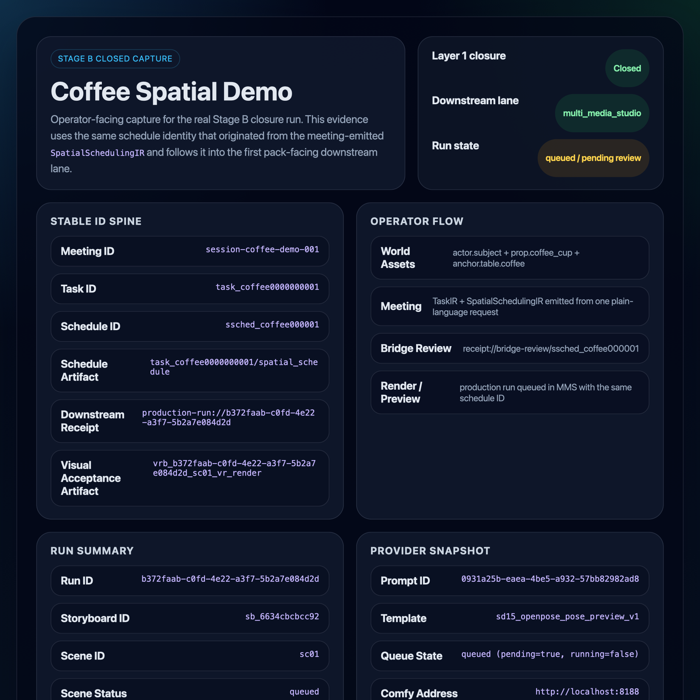
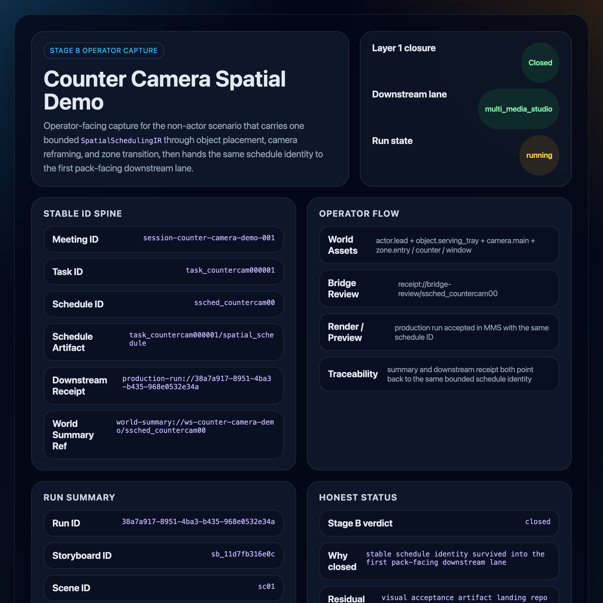
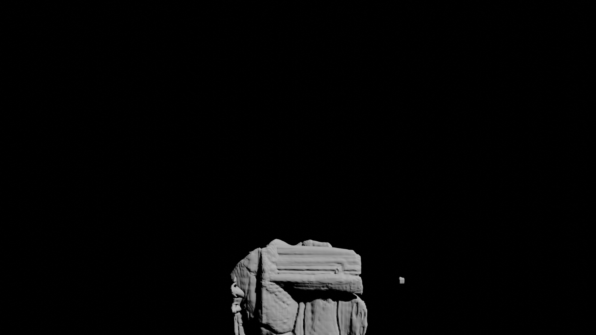
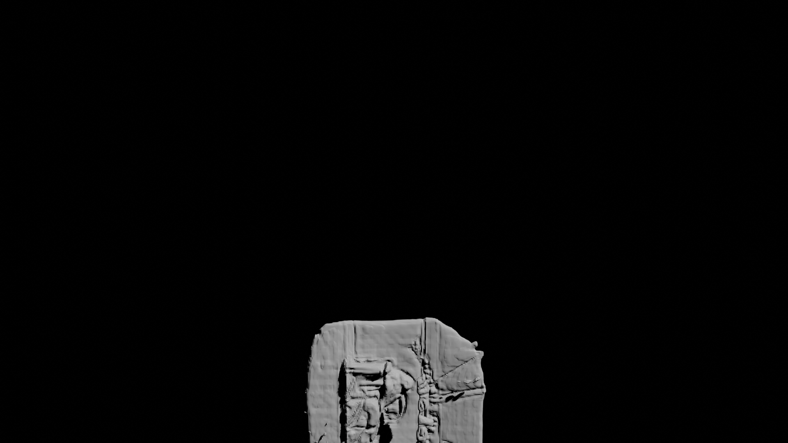

# Demo Gallery

This gallery is the fastest way to understand what Mindscape can demonstrate today without starting from pack internals.

## How To Read These Demos

Every demo should answer five questions:

1. What goes in?
2. What comes out?
3. What does this prove?
4. What does this not prove?
5. What is the current status?

## Current Demo Cards

### 1. Meeting-Originated Coffee Spatial Demo

- **What goes in**: one plain-language meeting request such as "have the subject walk to the table, pick up the coffee cup, take a sip, then place it back"
- **What comes out**: one `TaskIR`, one `SpatialSchedulingIR`, one bounded world summary, one operator handoff manifest, and one downstream preview or runtime receipt tied together by stable IDs
- **What this proves**: the repo can demonstrate `schedule -> summary -> handoff -> stable IDs` as a dynamic world/runtime story rather than only as static asset packaging
- **What this does not prove**: polished final animation quality or automatic stronger-runtime parity on every host
- **Current status**: Layer 1 closed; Layer 2 closed; the reference host now demonstrates a completed stronger-backend receipt through the same stable schedule spine
- **Deep dive**: [Meeting-Originated Coffee Spatial Demo](../use-cases/meeting-originated-coffee-spatial-demo.md)

This is the first public-safe hero candidate for the `SpatialSchedulingIR` milestone because it is understandable without pack internals:

- the operator states one plain-language action
- the meeting emits dual artifacts
- Local-Core keeps only bounded summary/refs/trace
- downstream consumer handoff can be inspected through stable IDs

Current evidence checked in on `2026-04-18`:

`Operator-facing capture`: the same run that closed Layer 1 and attached the real downstream `multi_media_studio` receipt to the bounded `coffee` bundle.

- **Evidence summary**: real downstream receipt attached, stable-ID spine preserved, operator-facing capture added, and a live `ComfyUI/Kimodo` stronger receipt attached through the same schedule spine
- **Current stronger-lane honesty note**: the reference host now returns a completed stronger-backend receipt on the same schedule identity without central IR schema changes or provider-payload writeback

### 2. Counter-Camera Non-Actor Spatial Demo

- **What goes in**: one plain-language meeting request about entry blocking, object placement on the counter, camera reframing, and zone exit
- **What comes out**: one `TaskIR`, one `SpatialSchedulingIR`, one bounded world summary, one operator handoff manifest, one real downstream `multi_media_studio` receipt, and one completed stronger `motion_runtime` receipt on the same schedule identity
- **What this proves**: the repo can preserve `object / camera / zone` semantics through the same `schedule -> summary -> handoff -> stable IDs` spine rather than only actor-first demos
- **What this does not prove**: that every renderer-side operational edge is solved on every workspace or host
- **Current status**: Layer 1 closed; Layer 2 closed; the reference host now demonstrates non-actor producer semantics through both downstream and stronger runtime lanes
- **Deep dive**: [Counter-Camera Non-Actor Spatial Demo](../use-cases/counter-camera-nonactor-spatial-demo.md)

Current evidence checked in on `2026-04-19`:

`Operator-facing capture`: the same run that attached the real `multi_media_studio` downstream receipt and then closed the stronger `motion_runtime -> ComfyUI/Kimodo` lane on the same bounded schedule identity.

- **Evidence summary**: non-actor `actor / camera / object / zone` semantics remain bounded in Local-Core, the same schedule identity survives into both consumer lanes, and no central IR schema changes were needed
- **Honesty note**: the downstream run still reports one visual-acceptance artifact landing warning tied to workspace FK enforcement, but this does not break the Layer 1 or Layer 2 acceptance gates

### 3. Single-Image Preview Mesh

- **What goes in**: one copyright-safe input image with a clear subject and scene
- **What comes out**: separate scene/person preview meshes plus a reviewable Blender bundle
- **What this proves**: a single image can be turned into bounded, inspectable preview assets
- **What this does not prove**: final production-grade 3D reconstruction
- **Current status**: supporting candidate preview lane; one indoor clean-space asset set is now checked in on this branch, with the mesh/workfile bundle preserved in internal evidence
- **Scope note**: this checked-in image set is a generic public-safe indoor lane, not the `@ipu__pilates` studio reference set
- **Deep dive**: [Single-Image Preview Mesh](../use-cases/single-image-preview-mesh.md)

Current checked-in evidence:

- **Evidence summary**: [`d1-indoor-clean-space-summary.json`](../assets/demo-gallery/d1-indoor-clean-space-summary.json)
- **Views summary**: [`d1-indoor-clean-space-views-summary.json`](../assets/demo-gallery/d1-indoor-clean-space-views-summary.json)
- **Observed result**: `promotion_state=candidate`
- **Observed result**: `mesh_validation.primary_contract_ready=true`
- **Honesty note**: the lane now has checked-in supporting assets, but it still reads better as a reference/supporting preview lane than as the first public hero screenshot

### 4. Fixed-Scene Subject Swap

- **What goes in**: one reusable scene package plus a new subject variation
- **What comes out**: multiple previews that preserve scene identity while changing the subject layer
- **What this proves**: scene continuity can be preserved while subject-specific outputs change
- **What this does not prove**: full multi-character production compositing
- **Current status**: supporting preview continuity lane; public deep dive published, screenshot bundle pending
- **Deep dive**: [Fixed-Scene Subject Swap](../use-cases/fixed-scene-subject-swap.md)

### 5. Scene Package Preview

- **What goes in**: multi-view or structured scene capture inputs
- **What comes out**: a scene package that can be handed to downstream consumers
- **What this proves**: scene identity and structure can be packaged as reusable assets
- **What this does not prove**: every downstream runtime import lane is closed
- **Current status**: active productization track

### 6. Object Preview Asset

- **What goes in**: a simple object-centric capture
- **What comes out**: a reusable preview asset or mesh sidecar
- **What this proves**: object-scale assets can be normalized into governed outputs
- **What this does not prove**: final cleanup for every object class
- **Current status**: active productization track

### 7. Candidate vs Fallback Comparison

- **What goes in**: one demo lane with both modeled and degraded paths
- **What comes out**: an honest side-by-side comparison
- **What this proves**: the repo explicitly distinguishes primary and degraded paths
- **What this does not prove**: the fallback lane is equivalent to the primary lane
- **Current status**: required honesty layer for public demos; public deep dive published, compare asset re-landing pending on the current branch
- **Deep dive**: [Candidate vs Fallback Comparison](../use-cases/candidate-vs-fallback-comparison.md)

Current truth-aligned note:

- the honesty deep dive is now published and anchors the `candidate / fallback` vocabulary
- the same-source compare card is still a supporting backlog item and should not be described as checked-in public evidence until the asset set is re-landed

### 8. Complex Relation Stress Case

- **What goes in**: one denser indoor image with a subject plus multiple scene objects and surfaces
- **What comes out**: a rough but inspectable scene-plus-person candidate bundle
- **What this proves**: the preview artifact contract can still close on a harder image, not just the clean hero lane
- **What this does not prove**: polished production geometry or clean launcher behavior on every host
- **Current status**: candidate stress-case preview lane
- **Deep dive**: [Complex Relation Stress Preview Mesh](../use-cases/complex-relation-stress-preview-mesh.md)

Current baseline checked in on `2026-04-16`:

- public-safe source input plus `front / oblique / side` stills are now checked in
- the lane proves bounded artifact closure under messier indoor conditions
- this case should be read as an honesty layer, not as the first hero screenshot

### 9. `@ipu__pilates` Supporting Demo

- **What goes in**: one public-safe curated reference from the `@ipu__pilates` lane
- **What comes out**: one checked-in source image, one checked-in preview render, one public summary JSON, and one internal scene/person mesh plus workfile bundle
- **What this proves**: the curated `@ipu__pilates` lane is no longer only internal staging; one real studio reference now has public-safe supporting evidence that matches the underlying mesh/workfile closure candidate
- **What this does not prove**: that all curated refs are already productized, or that the current runtime should be marketed as a formal `SAM3D` production lane
- **Current status**: public-safe supporting demo; first checked-in closure candidate `DRjrJ5KkoS4`
- **Deep dive**: [`@ipu__pilates` Supporting Demo](../use-cases/ipu-pilates-supporting-demo.md)

Current checked-in evidence:

- **Evidence summary**: [`d6-ipu-pilates-supporting-demo-summary.json`](../assets/demo-gallery/d6-ipu-pilates-supporting-demo-summary.json)
- **Honesty note**: the current closure candidate is `runtime_family=triposr`, `promotion_state=candidate`, and should not be described as a formal `SAM3D` asset until a later lane closes on that runtime family

## Screenshot Rule

When screenshots are added, each demo should include:

- source input
- operator-facing intermediate proof
- output artifact view
- status/limitation caption

If a checked-in still came from a headless/background Blender render, say so explicitly. That kind of capture is valid demo evidence, but it is not proof that an interactive Blender session remains open reliably on every host.

The D1 lane now has a published deep dive plus a re-landed indoor clean-space screenshot set. A literal Blender outliner screenshot remains optional if a more UI-oriented capture is desired, but the supporting image evidence is no longer missing on this branch.

## Milestone Acceptance Reminder

This gallery should not stop at static preview cards.

For the `SpatialSchedulingIR` milestone to be considered truly closed, the gallery must be able to show:

1. a meeting-originated dynamic spatial demo
2. bounded world summary evidence
3. stable-ID handoff evidence
4. a second-layer consumer-replaceability proof when a stronger motion backend is available

The current public state is:

- items `1-4` are now demonstrably closed on the reference host through the coffee and counter-camera demos
- new scenario work should now focus on additional spatial/world cases rather than reopening these acceptance gates
