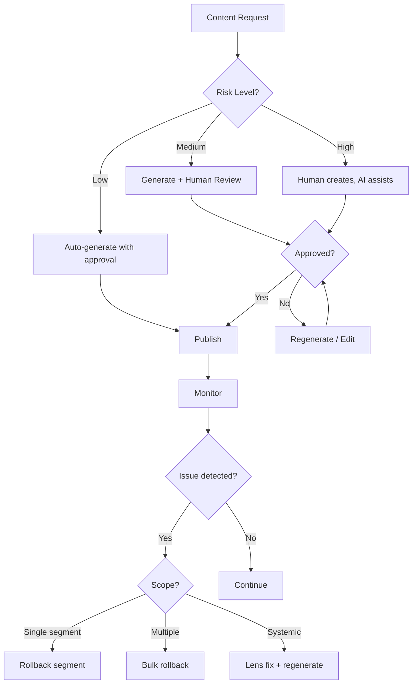

# Use Case: Brand Content Governance / 品牌內容治理

> **Category**: Brand & Marketing
> **Complexity**: High
> **Related Playbook**: `brand_content_suite`

---

## 1. Scenario Overview

**Goal**: Maintain brand voice and consistency across multiple channels (website, social media, customer support) while enabling local teams to adapt content for their specific contexts.

**The Challenge**: You have a brand with a defined voice and style. Your AI generates content for:
- Website copy
- Social media posts
- Customer support responses
- Email campaigns
- LINE/WhatsApp messaging

Without governance, brand voice drifts, inconsistencies appear, and when something goes wrong, you can't trace back to understand why.

**The Outcome**:
- Consistent brand voice across all channels
- Local adaptation without losing core identity
- Full traceability when issues arise
- One-click rollback to known-good states

---

## 2. The "Brand Drift" Problem

### Real Scenario: The Coffee Grinder Story

> A marketing team changed the prompt for their AI assistant to be "more friendly." Customer support wasn't updated. Customers noticed the brand felt like two different companies.

**Timeline**:
1. **Day 1**: Marketing updates Lens to "warm and playful"
2. **Day 3**: Support tickets mention "inconsistent brand voice"
3. **Day 5**: Social media team asks "which voice should we use?"
4. **Day 7**: Angry customer tweet: "your brand personality is all over the place"

**Without Governance**:
- No record of what changed or when
- No way to quickly sync all channels
- Manual investigation required

**With Mindscape Governance**:
- Dashboard shows: Lens changed from v1.1 → v1.2 on Day 1
- One-click: Propagate new Lens to all channels
- Or one-click: Rollback to v1.1 across all channels

---

## 3. Multi-Channel Lens Architecture

### The Solution: Core + Adaptor Pattern

```
                    ┌─────────────────────┐
                    │   Core Brand Lens   │  ← Single source of truth
                    │   (v2.0)            │
                    └─────────┬───────────┘
                              │
            ┌─────────────────┼─────────────────┐
            │                 │                 │
            ▼                 ▼                 ▼
    ┌───────────────┐ ┌───────────────┐ ┌───────────────┐
    │ Website       │ │ Social Media  │ │ Support       │
    │ Adaptor       │ │ Adaptor       │ │ Adaptor       │
    │ (formal +     │ │ (casual +     │ │ (helpful +    │
    │  detailed)    │ │  emoji OK)    │ │  solution)    │
    └───────────────┘ └───────────────┘ └───────────────┘
```

### Lens Inheritance

```yaml
# Core Brand Lens (applied to all channels)
core_lens:
  voice:
    brand_personality: professional_but_friendly
    key_values: [transparency, quality, innovation]
  constraints:
    - Never use hyperbole ("best in the world")
    - Always acknowledge uncertainty when present
    - Never make promises we can't keep

# Social Media Adaptor (inherits from core)
social_adaptor:
  extends: core_lens
  override:
    voice:
      tone: casual, energetic
    preferences:
      emoji: allowed
      hashtags: 2-3 per post
      length: under 280 characters
```

**When Core changes**:
- All Adaptors automatically inherit the change
- Channel-specific overrides are preserved
- Full diff available: "What changed for each channel?"

---

## 4. Segment-Level Rollback

### The Power of Fine-Grained Control

Traditional rollback:
> "Something's wrong with the homepage copy. Regenerate the entire page."

Segment-level rollback:
> "The hero section is fine, but the pricing section sounds too aggressive. Rollback just that section."

### Example: Product Page

```
┌─────────────────────────────────────────────────────────────┐
│  Product Page Asset                                          │
├─────────────────────────────────────────────────────────────┤
│  Segment: Hero Section                                       │
│  ├── Take #1: "Introducing..." ← Selection                  │
│  ├── Take #2: "Meet the future..."                          │
│  └── Take #3: "Transform your..."                           │
├─────────────────────────────────────────────────────────────┤
│  Segment: Features List                                      │
│  ├── Take #1: Technical focus ← Selection                   │
│  └── Take #2: Benefit focus                                 │
├─────────────────────────────────────────────────────────────┤
│  Segment: Pricing Section                                    │
│  ├── Take #1: Aggressive CTA        ← Problem here          │
│  ├── Take #2: Soft CTA              ← Better option         │
│  └── Take #3: Value comparison ← Selection (rollback target)│
└─────────────────────────────────────────────────────────────┘
```

**Rollback action**: Change Pricing Section Selection from Take #1 to Take #3
- Hero Section: unchanged
- Features List: unchanged
- Pricing Section: now shows Take #3 content

---

## 5. Provenance Queries

### When Something Goes Wrong

**Question**: "A customer complained our AI said something inappropriate. What happened?"

**Provenance Query**:
```
Query: Find all content generated with Lens v1.2 in the past week
       that contains keyword "guarantee"

Result:
- 47 segments across 12 assets
- 12 flagged for review (contain "guarantee" + "always")
- Lens change identified: v1.1 → v1.2 added "confident" tone

Action options:
1. Bulk rollback: Revert all 47 segments to previous Take
2. Selective fix: Review 12 flagged, regenerate with updated Lens
3. Lens fix: Update v1.2 → v1.3, then regenerate affected segments
```

### Audit Trail

Every piece of content knows:
- Which Intent triggered its creation
- Which Lens version styled it
- Which Playbook generated it
- When it was last modified
- Who approved the current Selection

---

## 6. Governance Workflow

### Standard Content Creation Flow



### Risk Level Determination

| Risk Level | Criteria | Example |
|------------|----------|---------|
| Low | Internal, routine, reversible | Internal newsletter draft |
| Medium | External, but recoverable | Social media post |
| High | Public, legal/compliance, irreversible | Press release, legal docs |

---

## 7. Integration with External Platforms

### WordPress Integration

```yaml
# Playbook: sync_to_wordpress
steps:
  - action: get_approved_content
    params:
      asset_type: website_copy
      status: approved

  - action: map_to_wp_slots
    params:
      mapping_config: wordpress_slot_mapping.json

  - action: push_to_wordpress
    service: wp_hub_connector
    params:
      dry_run: false
      create_backup: true
```

### Multi-Channel Sync

When content is approved:
1. Push to WordPress (website)
2. Queue for social media scheduler
3. Update support knowledge base
4. Sync to LINE/WhatsApp bots

All synchronized from a single source of truth.

---

## 8. Key Playbooks

| Playbook | Purpose |
|----------|---------|
| `brand_voice_check` | Validate content against brand guidelines |
| `cross_channel_sync` | Sync approved content to all channels |
| `lens_impact_analysis` | Show what would change if Lens is updated |
| `bulk_rollback` | Rollback multiple segments to a point in time |
| `content_audit` | Generate audit report for compliance |

---

## 9. Business Value

### Quantified Benefits

| Metric | Before Mindscape | After Mindscape |
|--------|-----------------|-----------------|
| Time to fix brand inconsistency | 2-3 days | < 1 hour |
| Content audit preparation | 1 week manual | Automated report |
| Cross-channel sync | Manual, error-prone | One-click, tracked |
| Rollback scope | Entire asset | Per-segment |
| Compliance confidence | "We think so" | Provenance proof |

---

## 10. Related Documents

- [Asset Provenance Architecture](../core-architecture/asset-provenance.md)
- [Mind-Lens Architecture](../core-architecture/mind-lens.md)
- [Lens Composition](../core-architecture/lens-composition.md)
- [Brand: User Experience Scenarios](file:///Users/shock/Projects_local/workspace/site-brand/sites/mindscape-ai/brand/product-design/08-user-experience-scenarios.md)
