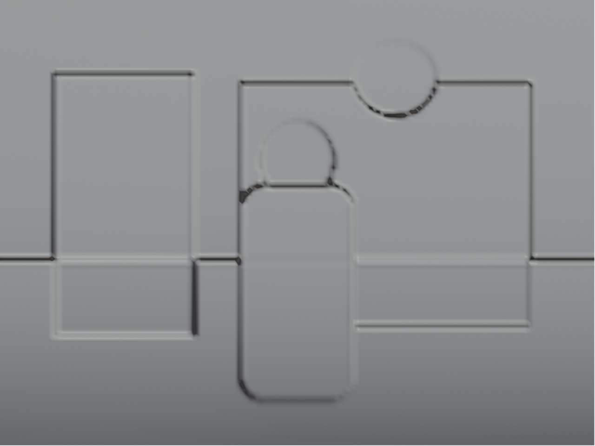
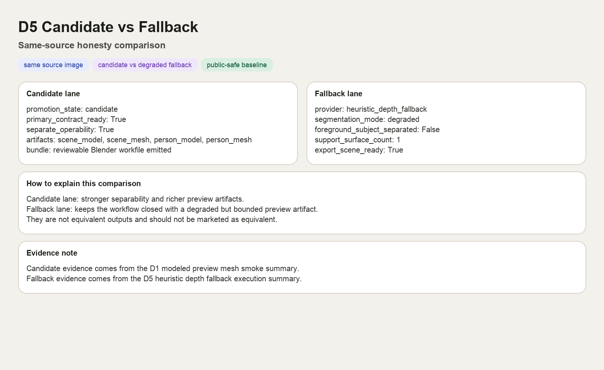

# Use Case: Candidate vs Fallback Comparison

> **Category**: Spatial Runtime / Honesty Layer
> **Complexity**: Medium
> **Current status**: First baseline comparison checked in

## 1. Scenario Overview

**Goal**: show the difference between a `candidate` modeled lane and a clearly marked degraded fallback lane when both start from the same source image.

This page exists to keep public-facing demos honest. It should be easy for a new reader to see that Mindscape distinguishes between:

- a stronger lane that emits richer, more editable preview artifacts
- a degraded lane that keeps the workflow closed but should not be described as equivalent

## 2. Shared Source Input

This comparison reuses the same copyright-safe source image from the D1 demo:

`Source input`: a synthetic indoor scene that is stable enough to compare multiple output lanes without changing the prompt or composition.

## 3. Candidate Lane Evidence

`Candidate lane`: the modeled preview lane emits separate scene/person preview meshes plus a reviewable Blender bundle.

Observed candidate evidence:

- `promotion_state=candidate`
- `mesh_validation.primary_contract_ready=true`
- separate `scene_model`, `scene_mesh`, `person_model`, and `person_mesh` artifacts were emitted

Evidence file:

- [`d1-single-image-preview-mesh-summary.json`](../assets/demo-gallery/d1-single-image-preview-mesh-summary.json)

## 4. Fallback Lane Evidence

`Fallback lane`: the degraded path uses `heuristic_depth_fallback` and emits a single approximate depth mesh scene instead of the richer modeled split.

Observed fallback evidence:

- `provider=heuristic_depth_fallback`
- `segmentation_mode=degraded`
- `foreground_subject_separated=false`
- `support_surface_count=1`
- `export_scene_result.ready=true`

Evidence file:

- [`d5-candidate-vs-fallback-fallback-execution-summary.json`](../assets/demo-gallery/d5-candidate-vs-fallback-fallback-execution-summary.json)

## 5. What This Proves

`Compare card`: a public-safe summary card that puts the main candidate and fallback signals side by side for onboarding and review.

- the repo explicitly distinguishes `candidate` and degraded `fallback` states
- the degraded lane can still produce bounded artifacts instead of failing silently
- the same source image can be used to explain quality and structure differences honestly

## 6. What This Does Not Prove

- that the fallback lane is equivalent to the modeled lane
- that the fallback lane preserves the same scene/person separability
- that the candidate lane is always available on every host/runtime combination

Use the status language explicitly:

> `Current status: fallback preview artifact, degraded and not equivalent to the candidate lane`

## 7. How To Explain The Difference

Prefer this framing:

- `candidate lane`: richer preview artifacts with stronger editability and separability
- `fallback lane`: bounded degraded artifact that preserves continuity and inspectability

Avoid this framing:

- `candidate and fallback are just different render styles`
- `fallback is basically the same result but faster`

## 8. Current Baseline Note

The current D5 baseline compare is valid as public-facing documentation evidence.

Implementation note:

- the `heuristic_depth_fallback` evidence is checked in and reusable now
- the generic fallback smoke wrapper on this host still has launcher-related instability, so the current baseline should be treated as verified demo evidence first, and as a runtime-stability claim second
- the checked-in stills for this comparison were produced by headless/background Blender runs that exit after rendering; that exit behavior is expected for documentation capture and should not be confused with interactive session stability

## 9. Related Docs

- [Demo Gallery](../demo-gallery/README.md)
- [Single-Image Preview Mesh](./single-image-preview-mesh.md)
- [Artifact Taxonomy](../reference/artifact-taxonomy.md)
