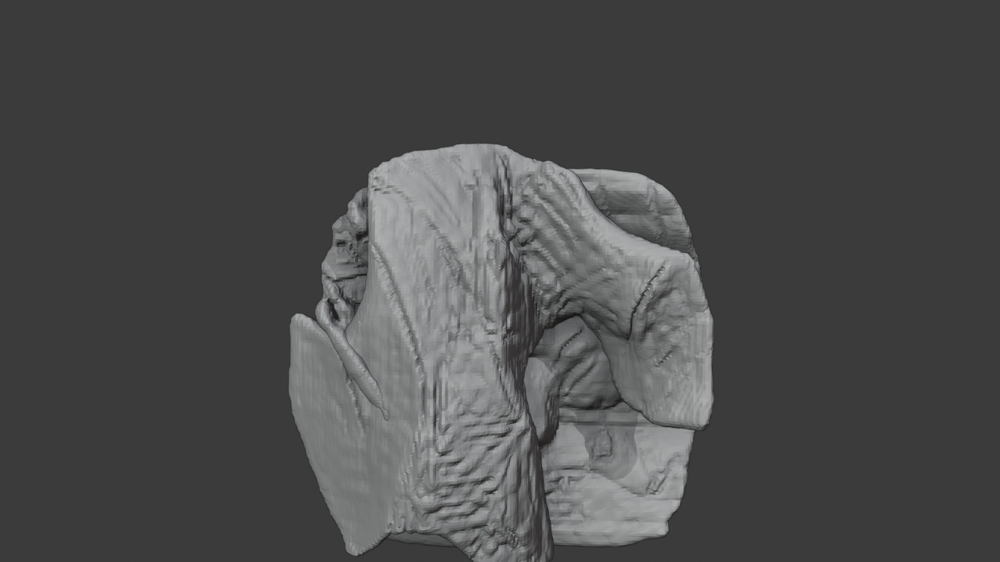
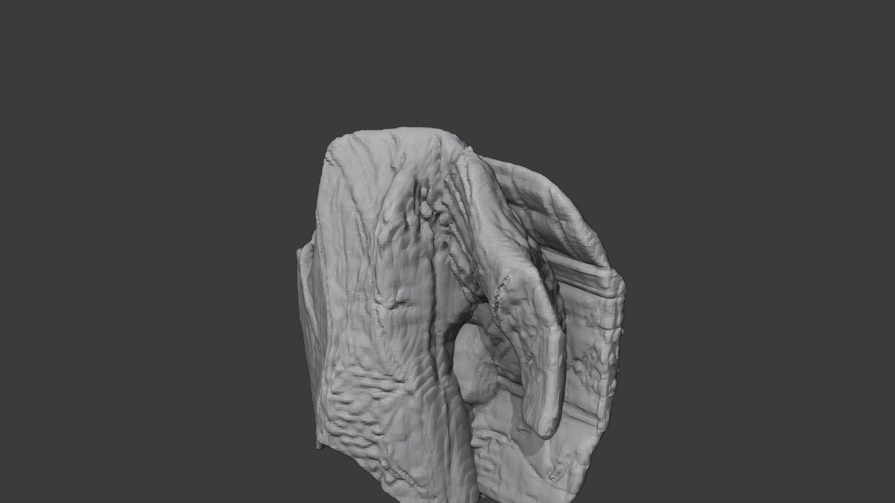
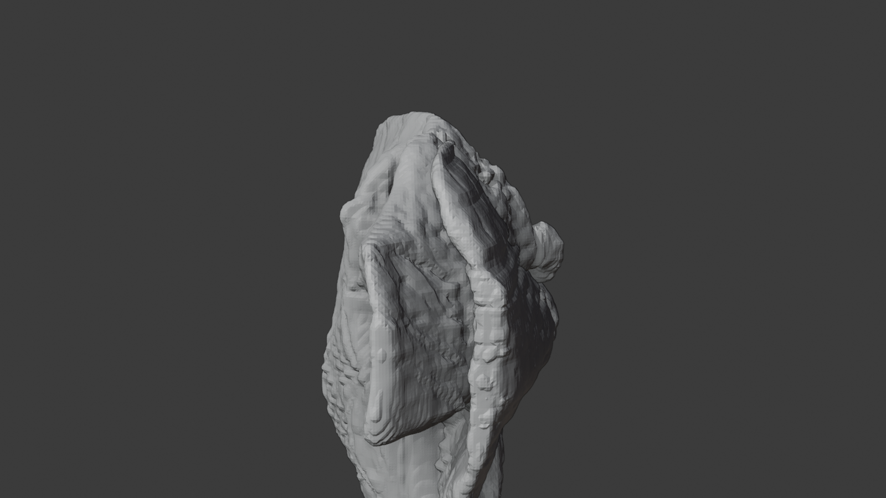

# Use Case: Complex Relation Stress Preview Mesh

> **Category**: Spatial Runtime / Honesty Case
> **Complexity**: Medium
> **Current status**: Candidate stress-case preview lane

## 1. Scenario Overview

**Goal**: show that the repo can still emit bounded scene-plus-person preview artifacts when the input image contains a denser indoor layout with multiple objects and tighter spatial relationships.

This page is intentionally not a hero case.

It exists to answer a harder public-facing question:

> what happens when the source image is not a clean minimalist scene?

## 2. What Goes In

The current stress image includes:

- one seated subject
- indoor decorative objects
- layered table and support surfaces
- partition or screen structure
- framed window geometry

This is useful because it pushes beyond the simplest `single subject + clean room` story without turning into a crowd scene.

`Source input`: a copyright-safe synthetic indoor scene with a denser object graph than the D1 hero lane.

## 3. What Comes Out

Public-safe outputs to talk about:

- separate scene/person preview artifacts
- a reviewable Blender bundle
- fixed-view stills that prove the candidate result is inspectable

The point of this page is not perfect geometry.

The point is that the lane still closes with bounded artifacts instead of collapsing into an unexplainable failure.

## 4. Current Checked-in Evidence

`Preview render`: the first front-facing still from the generated Blender review bundle.

`Oblique view`: a documentation still used to make the rough scene/person separation more inspectable.

`Side view`: a documentation still that helps prove the result is still a bounded candidate artifact rather than a flat screenshot trick.

Observed evidence:

- `promotion_state=candidate`
- `mesh_validation.primary_contract_ready=true`
- `blender_separate_operability=true`
- scene and person preview artifacts were emitted
- the composition bundle emitted a reviewable Blender workfile plus an export scene artifact

Evidence files:

- [`d3-complex-relation-stress-summary.json`](../assets/demo-gallery/d3-complex-relation-stress-summary.json)
- [`d3-complex-relation-stress-views-summary.json`](../assets/demo-gallery/d3-complex-relation-stress-views-summary.json)

## 5. What This Proves

- a denser indoor image can still be closed into bounded scene-plus-person candidate artifacts
- the repo can present a stress case honestly instead of only publishing its cleanest example
- the demo set now covers both `hero-like` and `rougher but real` preview conditions

## 6. What This Does Not Prove

- production-grade modeling quality for multi-object indoor scenes
- that every host has fully clean launcher behavior for background Blender composition
- that this stress lane should be presented as equivalent to the cleaner hero lane

Use the status language explicitly:

> `Current status: candidate stress-case preview artifact, useful for honesty and operator inspection, not a polished hero reconstruction`

## 7. How To Explain This Page

Prefer this framing:

- `hero lane`: easiest image to understand the artifact contract
- `stress lane`: harder image that proves the contract still closes under messier spatial conditions

Avoid this framing:

- `this looks rough because the demo is broken`
- `this is the same quality bar as the clean hero lane`

## 8. Capture Mode Note

- the checked-in stills for this page were produced from a generated Blender bundle after composition completed
- they are valid documentation evidence for the candidate artifact lane
- they should not be used as a blanket claim that every host already has perfect background-composition launcher stability

## 9. Related Docs

- [Demo Gallery](../demo-gallery/README.md)
- [Single-Image Preview Mesh](./single-image-preview-mesh.md)
- [Candidate vs Fallback Comparison](./candidate-vs-fallback-comparison.md)
- [Artifact Taxonomy](../reference/artifact-taxonomy.md)
