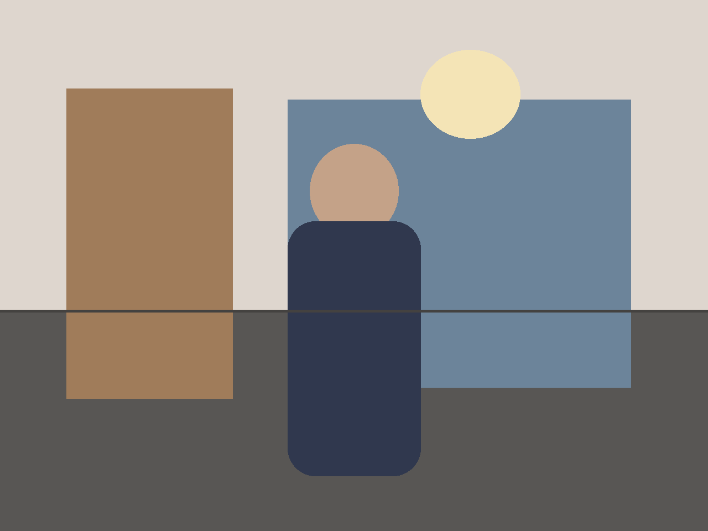
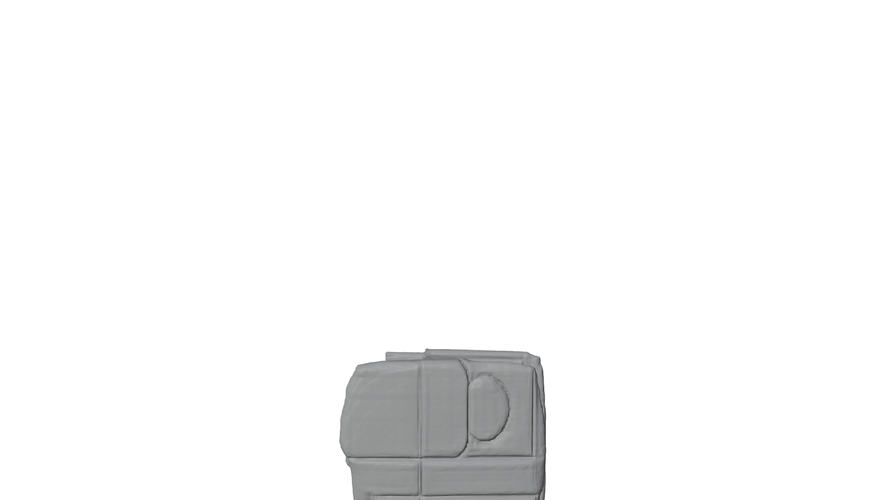
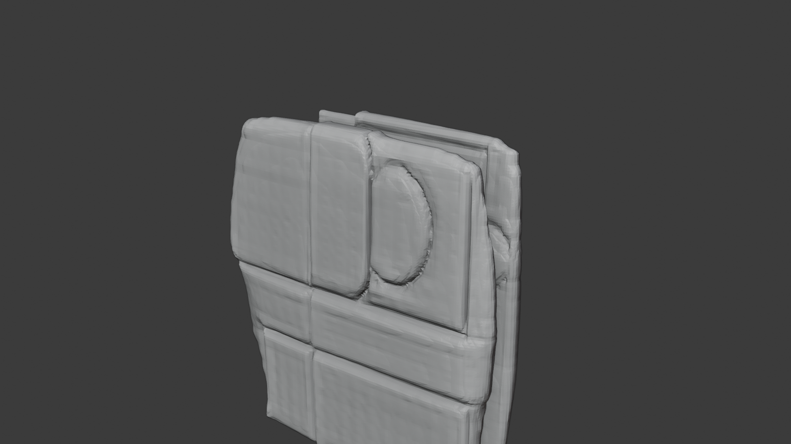
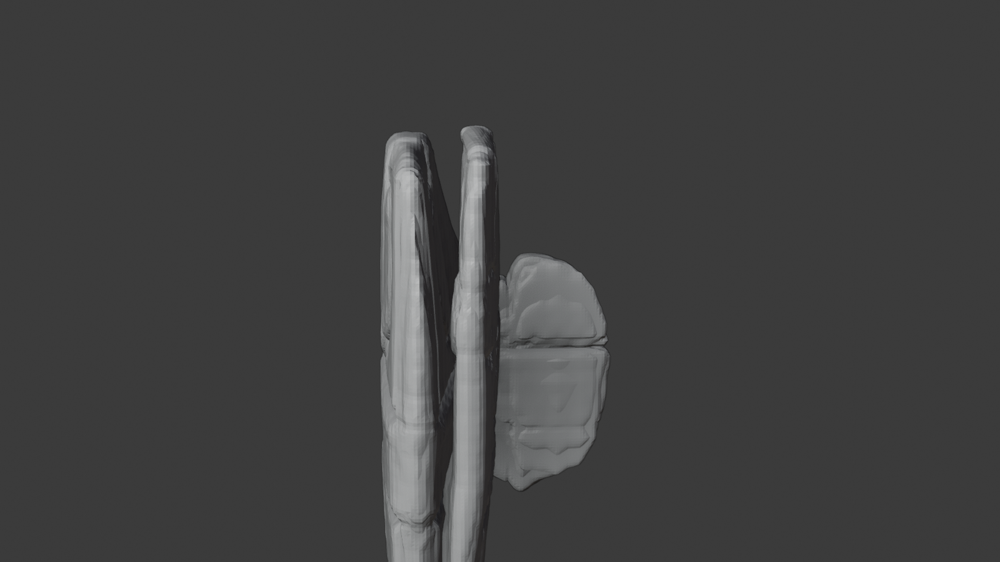
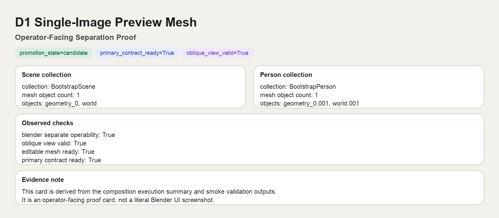
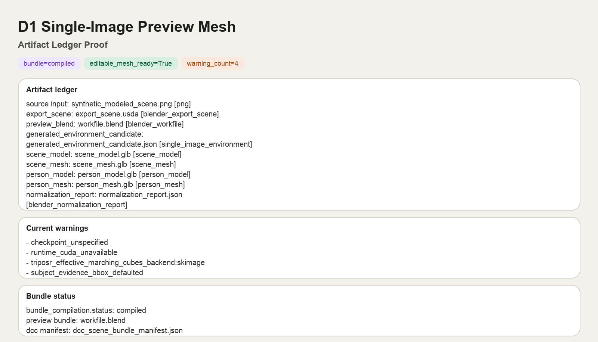

# Use Case: Single-Image Preview Mesh

> **Category**: Spatial Runtime / 3D Preview
> **Complexity**: Medium
> **Current status**: Candidate preview lane

## 1. Scenario Overview

**Goal**: turn one copyright-safe image into separate scene/person preview meshes that can be inspected, compared, and used as bounded downstream artifacts.

This is the easiest public-facing 3D demo for the current repo because it shows a complete artifact story without forcing readers to learn pack internals first.

## 2. What Goes In

The ideal input image should be:

- copyright-safe
- a single subject
- a clear indoor or bounded scene
- visibly separated floor and wall planes
- low in mirrors, glass, logos, and crowd complexity

Recommended starter theme:

- a minimalist AI-generated yoga studio scene

Other good themes:

- virtual host corner
- small product display booth

## 3. What Comes Out

Public-safe outputs to talk about:

- separate scene/person preview meshes
- a reviewable Blender bundle
- runtime receipt or artifact references that prove the lane completed

What the operator should be able to inspect:

- scene and person separation
- non-flat side view or structural depth
- a bounded artifact list that can be passed downstream

## 4. What This Proves

- one image can be compiled into bounded preview assets
- scene and subject can be separated into reviewable outputs
- the workflow closes with artifacts and traceability, not just text claims

## 5. What This Does Not Prove

- that the output is final production-grade 3D reconstruction
- that every modeled result has final visual fidelity
- that every downstream runtime/import lane is already closed

Use the status language explicitly:

> `Current status: candidate preview artifact, not production-grade reconstruction`

## 6. Current Smoke Evidence

The first public-safe smoke capture for this lane is now checked in.

`Source input`: a synthetic, copyright-safe indoor scene used to validate the lane end to end.

`Preview render`: a Blender Workbench capture from the generated review bundle. This is intentionally shown as a rough candidate artifact so readers can see the current quality bar honestly.

`Oblique view`: a documentation capture from the same `.blend` bundle that makes scene/person separation easier to inspect without opening Blender.

`Side view`: a documentation capture used to prove the result is not just a single flat card. This does not prove final geometry quality; it only proves non-trivial mesh depth.

`Separation proof card`: a public-safe operator card derived from the composition execution summary. It shows the scene/person collection split and the checks that closed successfully.

`Artifact ledger card`: a public-safe artifact list derived from the smoke summary and bundle manifest. It is the fastest way to show what was emitted without exposing pack internals.

Capture mode note:

- the checked-in stills for this page were produced by headless Blender batch runs that exit after rendering
- this evidence proves the candidate preview lane can emit bounded artifacts; it does not by itself prove that an interactive Blender session stays open reliably on every host

Smoke evidence summary:

- `promotion_state=candidate`
- `mesh_validation.primary_contract_ready=true`
- separate `scene_model`, `scene_mesh`, `person_model`, and `person_mesh` artifacts were emitted
- a reviewable Blender bundle was emitted
- current warnings include `checkpoint_unspecified`, `runtime_cuda_unavailable`, `triposr_effective_marching_cubes_backend:skimage`, and `subject_evidence_bbox_defaulted`

Evidence file:

- [`d1-single-image-preview-mesh-summary.json`](../assets/demo-gallery/d1-single-image-preview-mesh-summary.json)
- [`d1-single-image-preview-mesh-views-summary.json`](../assets/demo-gallery/d1-single-image-preview-mesh-views-summary.json)
- [`d1-single-image-preview-mesh-doc-cards-summary.json`](../assets/demo-gallery/d1-single-image-preview-mesh-doc-cards-summary.json)

## 7. Suggested Screenshot Sequence

1. original source image
2. Blender outliner showing scene/person separation
3. side view proving the result is not just a flat card
4. viewport or preview render
5. output artifact list

The current checked-in smoke set covers steps `1`, `3`, `4`, and `5`. Step `2` now has a public-safe operator proof card. A literal Blender outliner screenshot is still optional if a more UI-oriented capture is desired.

## 8. Operator Journey

1. start with one copyright-safe source image
2. run the preview lane
3. inspect the bounded artifacts
4. validate that the result is a usable preview/candidate lane
5. decide whether to keep iterating, hand off downstream, or fall back

## 9. Public-safe Language

Prefer:

- `single-image preview mesh`
- `separate scene/person preview meshes`
- `reviewable Blender bundle`

Avoid as first-line claims:

- `final 3D reconstruction`
- `production-ready scene model`
- provider-specific runtime names in the page title

## 10. Related Docs

- [Demo Gallery](../demo-gallery/README.md)
- [Artifact Taxonomy](../reference/artifact-taxonomy.md)
- [Spatial Runtime Planning](../core-architecture/spatial-runtime-planning.md)
