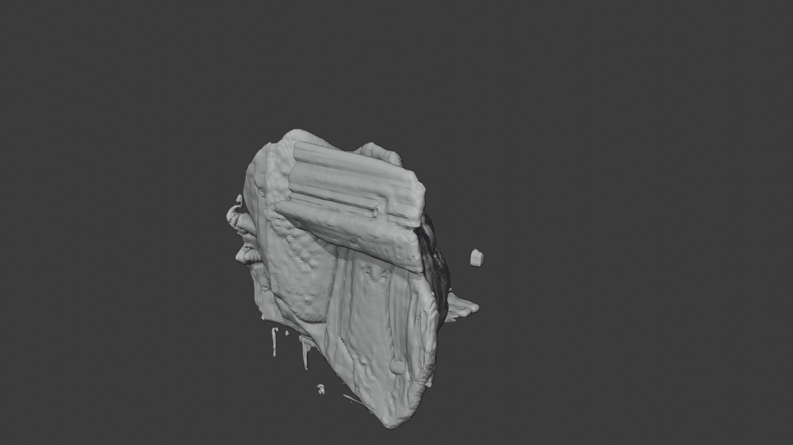
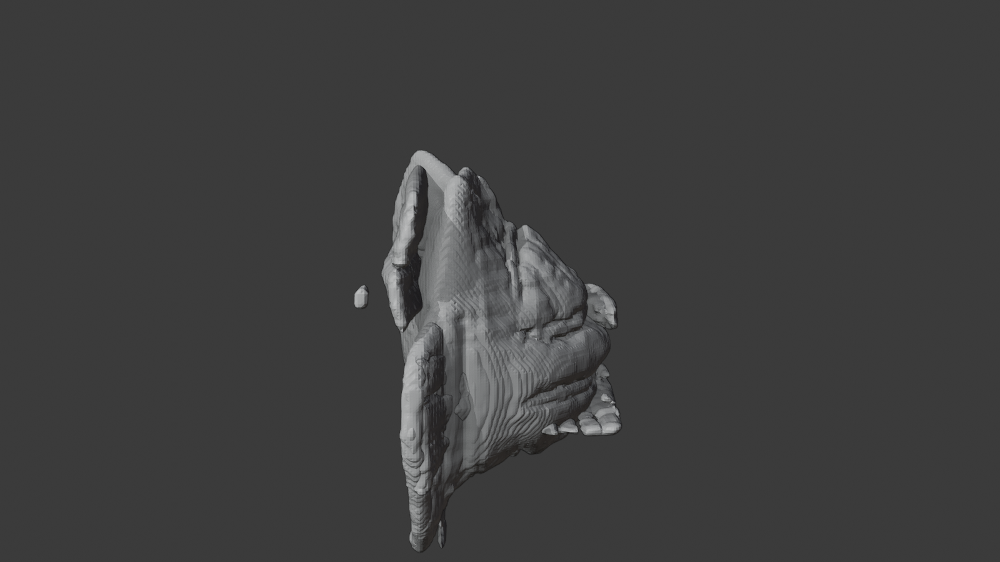

# Use Case: Single-Image Preview Mesh

> **Category**: Spatial Runtime / Preview Asset  
> **Complexity**: Medium  
> **Current status**: Supporting candidate preview lane; an indoor clean-space asset set is now checked in on this branch, with the corresponding mesh/workfile bundle preserved in internal evidence

## 1. Scenario Overview

This use case answers a simple public-facing question:

> can one image be turned into a bounded, inspectable preview artifact rather than an opaque black-box output?

The intended story is not "final 3D reconstruction from one image."

The intended story is:

- one image enters
- bounded preview artifacts come out
- the operator can inspect the result
- the repo stays honest about `preview` and `candidate` status

## 2. What Goes In

The ideal input is:

- one copyright-safe or synthetic image
- one clearly readable subject
- one scene with legible floor, wall, or support-surface structure

This lane is easiest to explain when the image is visually simple and the subject is easy to separate from the surrounding scene.

## 3. What Comes Out

The expected public-safe outputs are:

- separate scene/person preview meshes
- a reviewable Blender bundle or equivalent inspection artifact
- a machine-readable summary that records current status and warnings

The operator story should stay artifact-first:

- preview mesh
- candidate bundle
- reviewable output

not pack-first.

## 4. What This Proves

- one image can still be turned into bounded, inspectable preview outputs
- the repo can talk about a 3D-adjacent lane without over-claiming final geometry quality
- public docs can explain `preview` and `candidate` in artifact language rather than provider language

## 5. What This Does Not Prove

- final production-grade 3D reconstruction
- guaranteed high-fidelity geometry for every image class
- that every host already has a fully landed public screenshot bundle for this lane

Use honest status language:

> This is a candidate preview lane that demonstrates bounded artifact closure, not polished final reconstruction.

## 6. Current Public Evidence Status

This supporting lane now has one checked-in indoor clean-space evidence set on the current branch:

Current evidence summary:

- [`d1-indoor-clean-space-summary.json`](../assets/demo-gallery/d1-indoor-clean-space-summary.json)
- [`d1-indoor-clean-space-views-summary.json`](../assets/demo-gallery/d1-indoor-clean-space-views-summary.json)

What is now true:

- the page is no longer relying only on abstract status language
- the supporting image set is checked in and readable from public docs
- the corresponding `.blend` / `.glb` bundle has been preserved in internal evidence for operator inspection
- this checked-in indoor clean-space set is a generic public-safe supporting lane, not the `@ipu__pilates` studio reference set

What is still not being claimed:

- this is not promoted as the first public hero screenshot
- this does not prove polished final geometry
- this page does not claim `@ipu__pilates` reference-image coverage

## 7. How To Explain This Page

Prefer this framing:

- `single-image in`
- `bounded preview artifacts out`
- `candidate, inspectable, reviewable`

Avoid this framing:

- `one-click final 3D model`
- `production-ready reconstruction from one still`

## 8. Related Docs

- [Demo Gallery](../demo-gallery/README.md)
- [Candidate vs Fallback Comparison](./candidate-vs-fallback-comparison.md)
- [Complex Relation Stress Preview Mesh](./complex-relation-stress-preview-mesh.md)
- [Artifact Taxonomy](../reference/artifact-taxonomy.md)
